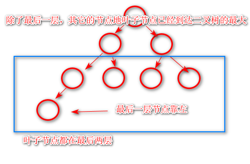
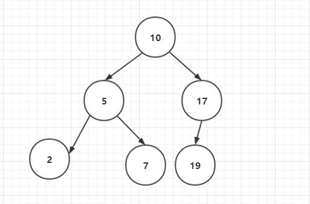
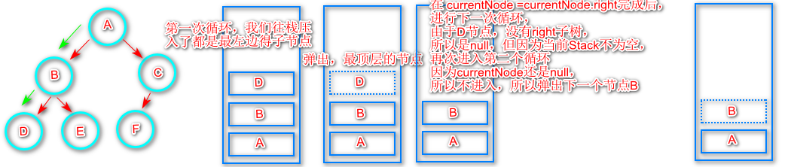
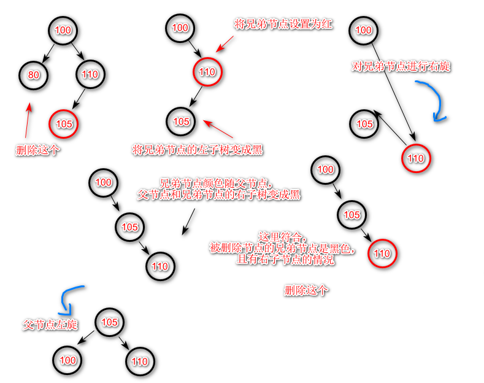
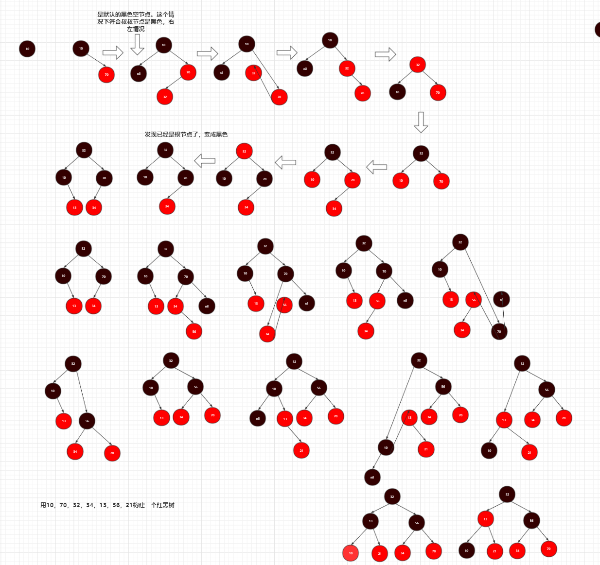

### 算法

一些算法的总结

##### 复杂度

什么是**时间复杂度**(What is time complexity)

数据量的增加所导致的时间花费的增加是怎么样的

时间是呈线性增加，还是常数，还是指数，指的是一种变化趋势

```java
//嵌套代码
int n = 10;
for(int i =0;i<=n;i++){
     
    for(int j =0;j<=2;j++){
        ...
    }
    //随着当 n 为 10 的时候，这里要计算 10*2 次，当为100 时，计算100*2
    //所以我们可以认为这个循环的时间复杂度为 O(2n)
}

for(int i =0;i<=n;i++){
    
    for(int j =0;j<=n;j++){
        ...
    }
    // 沿用上面的观点，这个为0(n^2)
}
```

常见的算法时间复杂度由小到大依次为

```
          n        n
O(1)<O(log )<O(nlog )<O(n^2)<O(n^3)<...<O(n^2)<O(n!)
          2		   2
```

什么是**空间复杂度**(What is space complexity)

trade off

选择，是空间换时间，还是反之

##### 维度

* 时间维度
  * 是指执行当前算法所消耗的时间，通常用时间复杂度来描述
* 空间维度
  * 是指执行当前算法需要占用多少内存空间，我们通常用**空间复杂度**来描述

##### 空间复杂度定义

是对一个算法运行过程中临时占用存储空间大小的量度

记做S(n)=O(f(n))


#### 链表

* 什么是线性表(What is Linear List)?
  * 线性表就是数据排成一条线一样的结构
    * 数组
    * 栈
    * 队列
    * 链表
  * 非线性
    * 二叉树
    * 图
    * 堆
    * ....

对于`ArrayList`的解析。我们从增删改差几个方法来入手看看`ArrayList`的实现这些`api`的时间复杂度是怎样的。

```java
//ArrayList.java

 public void add(int index, E element) {
     	//检查是否越界 否则做扩容操作
        rangeCheckForAdd(index);
		//如果没有越界，则进行累加
        ensureCapacityInternal(size + 1);  // Increments modCount!!
     	//由于我们是指定位置的插入，所有需要将该 index位置后方的所有元素全部移动一位
     	//有多少便多少位置，所以时间负责度为O(n)
        System.arraycopy(elementData, index, elementData, index + 1,
                         size - index);
     	//最后赋值操作
        elementData[index] = element;
        size++;
    }

public E remove(int index) {
    	//同样检查是否越界
        rangeCheck(index);

        modCount++;
    	//取出该位置的值
        E oldValue = elementData(index);

        int numMoved = size - index - 1;
    	//如果需要删除的这个元素的位置是合法位置，即是在 0~size 之间
        if (numMoved > 0)
            //将指定删除位置的元素后方的所有元素向前移动一位，因此时间复杂度为O(n)
            System.arraycopy(elementData, index+1, elementData, index,
                             numMoved);
        elementData[--size] = null; // clear to let GC do its work

        return oldValue;
    }

public E get(int index) {
        rangeCheck(index);
	// 由于ArrayList 当你不指定大小的时候，会默认给你初始化长度为10的Object数组，这里直接用
    // 数据的索引直接获取结果，所以复杂度为O(1),可以直接定位
        return elementData(index);
    }
 E elementData(int index) {
        return (E) elementData[index];
    }

 public E set(int index, E element) {
        rangeCheck(index);
		//修改方法，用于直接替换，查找方法也沿用了get方法O(1),所以设值时间复杂度和get的时间复杂度一致
        E oldValue = elementData(index);
        elementData[index] = element;
        return oldValue;
    }
	//默认构造器的初始化常量数组，未指定大小
	private static final Object[] DEFAULTCAPACITY_EMPTY_ELEMENTDATA = {};
	//实际用于存放List数组的数据
    transient Object[] elementData; // non-private to simplify nested class access、

	public ArrayList() {
        this.elementData = DEFAULTCAPACITY_EMPTY_ELEMENTDATA;
    }

	public ArrayList(int initialCapacity) {
        if (initialCapacity > 0) {
            //当指定容量大小的时候，会为你创建默认大小，这也是比比较推荐的初始化方法
            this.elementData = new Object[initialCapacity];
        } else if (initialCapacity == 0) {
            this.elementData = EMPTY_ELEMENTDATA;
        } else {
            throw new IllegalArgumentException("Illegal Capacity: "+
                                               initialCapacity);
        }
    }

// 剖析ArrayList的无参构造器的具体容量在哪里
	public boolean add(E e) {
    	//进入这个方法
        ensureCapacityInternal(size + 1);  // Increments modCount!!
        elementData[size++] = e;
        return true;
    }
	private void ensureCapacityInternal(int minCapacity) {
        //进入第二个 这里其实会考虑做扩容操作，比较现在的数据大小和增加新元素后的List大小
        ensureExplicitCapacity(calculateCapacity(elementData, minCapacity));
    }
	private static int calculateCapacity(Object[] elementData, int minCapacity) {
        //很明显，如果我们使用了无参的构造器的话，会进入这个判断，因为初始化用的就是这个
        //这个使用会返回 DEFAULT_CAPACITY 
        if (elementData == DEFAULTCAPACITY_EMPTY_ELEMENTDATA) {
            return Math.max(DEFAULT_CAPACITY, minCapacity);
        }
        return minCapacity;
    }
	/**
     * Default initial capacity.
       所以无参构造器在初始化的时候其实还没有指定容量的大小，在真正add方法执行的时候
       会做真正的初始化，默认大小为10，即会默认创建大小为10的Object数组，即使你没用到10个元素
     */
    private static final int DEFAULT_CAPACITY = 10;
```

* `ArrayList`的几个使用建议
  * 能不用默认构造器就不要使用默认构造器
  * 如果事先知道需要填入的大小，可以使用含有参数的构造器，并填入数值进行初始化
  * 如果你不清楚的实际使用大小，也可以预估将会有多少元素
  * `ArrayList`的crud方法的算法时间复杂度维度也可以看出，该List在查和修改性能很出色都为0(1)，删除和新增都为O(n)较差
  * 因为底层是对象数组实现，所以他们在**物理**和**逻辑**存储单元都是连续的。

#### 什么是Linked List 什么是链表

链表是一种物理存储单元上非连续的，非顺序的存储结构，数据元素的逻辑顺序是通过链表中的指针连接次序实现的。

这里不做源码分析，由于链表的形式

```java
class ListNode{
    Object data;//当前节点保存的值
    ListNode next;//指向下一个节点
}
```


对于链表而言，删除和新增对于他来说是简单的只要断开原本的引用指针，指向新的即可，对于删除的，只需要断开被删除的next指针，将被删除的节点的前后节点next重新指向即可，所以删除和新增的操作的时间复杂度都是0(1)

## 约瑟夫问题

约瑟夫问题是个著名的问题：N个人围成一圈，第一个人从1开始报数，报M的将被杀掉，下一个人接着从1开始报。如此反复，最后剩下一个，求最后的胜利者。 
例如只有三个人，把他们叫做A、B、C，他们围成一圈，从A开始报数，假设报2的人被杀掉。

- 首先A开始报数，他报1。侥幸逃过一劫。
- 然后轮到B报数，他报2。非常惨，他被杀了
- C接着从1开始报数
- 接着轮到A报数，他报2。也被杀死了。
- 最终胜利者是C

但是链表只是逻辑上连续，他并不能做到像是数组那样，使用位置即可定位，他的依据是从头节点开始遍历，不断的寻找下一个节点。所以他的时间复杂度是O(n)


##### 链表和数组的区别

在内存分配上，数组一定要保证内存一定要有数组申请的那么大的空间才会创建成功，而链表不会。


#### 循环链表

即尾巴节点直接和头部相连接，组成一个环

#### 双向链表

what is double linked list，双向链表在单链表的每个结点中，再设置一个指向前驱节点的指针。

```java
public class Node{
    //数据本身
    private Object data;
    //前一个节点
    private Node pre;
    //后一个节点
    private Node next;
    
}
```

也是从增删改查这些问题入手。

对于增加和删除和之前的链表没有什么区别，都是O(1)，查询其实会比普通链表稍微高一点，因为他可以记住前节点的应用，他可以根据找到的值大小来决定是否接着向后遍历还是向前遍历。单向链表如果想要知道他的前一个节点是什么，还需要重新再遍历一次。

即便双向链表在空间上花费比单向要高些，这也是空间换时间的例子。

```java
// 反转链表 1->2->3->4->5
public ListNode reverseList(ListNode head){
    if(head==null){
        return null;
    }
    ListNode prev = head;
    ListNode current = head.next;
    //断开下一个节点
    prev.next = null;
    // 1 2->3->4->5
    while(current!=null){
        ListNode next = current.next;
        // // 1<-2->3->4->5
        current.next = prev;//将断开的节点反方向接上
        prev = current;//切换到下一个
        current=next;
    }
    return prev;
}

// 1->2->3->4->5 
// 1->4->3->2->5
// 1<=m<=n<=length
public ListNode reversedBetween(ListNode head,int m,int n){
    if(head==null||m>=n){
        return head;
    }
    //为了保证头节点不丢失，创建哨兵节点dummy
    ListNode dummy = new ListNode(-1);
    //将头节点地引用保留
    dummy.next = head;
    //将指针变为头节点
    head=dummy;
    //接着以m为界限，找到反转地起始点地前一个节点
    for(int i=0;i<m;i++){
        head=head.next;
    }
    //接着，定义几个变量
    //保留目前起始反转节点的前一个节点
    // -1->1->2->3->4->5
    ListNode prevN = head;
    ListNode mNode = head.next;//找到m位置地节点
    ListNode nNode = mNode;//保存这个节点地位置
    ListNode postN = nNode.next;//m节点地下一个位置
    //现在把他当做是普通地反转链表来处理就行
    for(int i =m;i<n;i++){
        /*
        ListNode next = current.next;
        current.next = prev;//将断开的节点反方向接上
        prev = current;//切换到下一个
        current=next;
        
        */
        ListNode next=postN.next;
        //同样，反向接上
        postN.next = nNode;
        nNode = postN;
        postN = next;
    }
    prevN.next=nNode;
    mNode.next=postN;
    return head;
}
```


 ##### 深度拷贝带随机指针地链表

Copy List With Random Pointer

例如，A对象含有引用类型得变量B，对A对象进行深度拷贝后得到C，这个时候C中得引用应该与母体地变量B不一样，即深度拷贝后，引用类型也必须是完全不一样地值。如果一样就是只是简单地值拷贝，引用还是一样地。

现在有一个链表，节点地结构是这样的

``` java
class Node{
    //含有下一个节点
     Node next;
    //某一个随机指向这条链表某个节点地指针，可能没有指向，为null
     Node random;
    //含有地值
     int val;
    public Node(int val){
        this.val = val;
    }
}
```


如图，例如这是一个五个节点地链表，其中2节点地random参数，随机指向了5节点，其它都没有特殊地指向，对这样地一个链表进行深度拷贝。

解题思路，要对这样链表进行深度拷贝，首先要创建和他一样多地节点，并且按照顺序将他们连接起来，这样就完成了拷贝。首先如果要按照原链表地顺序地话，就要用关系将他们对应起来。

```java
public Node copyRandomList(Node head){
    if(head==null){
        return null;
    }
    //保存映射关系的map
    Map<Node,Node> map = new HashMap<Node,Node>();
    //首先将头保留一下
   	Node newHead = head;
    //循环，开始复制
    while(newHead!=null){
        // 创建映射
        if(!map.containsKey(newHead)){
            Node copyNode = new Node(newHead.val);
            map.put(newHead,copyHead);
            //这个循环走下去，其实已经完成了所有节点地拷贝，连顺序也对应好了
        }
        //再判断一下是否有random地存在
        if(newHead.random!=null){
            Node random = newHead.random;
                if(!map.containsKey(random)){
					  //对随机指针对象进行拷贝
            		Node copyRandom = new Node(random.val)；    
                    map.put(random,copyRandom);
                }
            //根据原链表地random地映射关系，建立关系
            map.get(newHead).random = map.get(random);
        }
     	//走下一次循环
        newHead = newHead.next;
    }
    //以上代码，结构变成了这样
}
```


```java
//接着，将他们地关系根据map对应起来
newHead = head;
while(newHead!=null){
    map.get(newHead).next = map.get(newHead.next);
    newHead = newHead.next;
}
return map.get(head);
```

```java 
//完整代码
public Node copyRandomList(Node head){
    if(head==null){
        return null;
    }
    //保存映射关系的map
    Map<Node,Node> map = new HashMap<Node,Node>();
    //首先将头保留一下
   	Node newHead = head;
    //循环，开始复制
    while(newHead!=null){
        // 创建映射
        if(!map.containsKey(newHead)){
            Node copyNode = new Node(newHead.val);
            map.put(newHead,copyHead);
            //这个循环走下去，其实已经完成了所有节点地拷贝，连顺序也对应好了
        }
        //再判断一下是否有random地存在
        if(newHead.random!=null){
            Node random = newHead.random;
                if(!map.containsKey(random)){
					  //对随机指针对象进行拷贝
            		Node copyRandom = new Node(random.val)；    
                    map.put(random,copyRandom);
                }
            //根据原链表地random地映射关系，建立关系
            map.get(newHead).random = map.get(random);
        }
     	//走下一次循环
        newHead = newHead.next;
    }
    //接着，将他们地关系根据map对应起来
	newHead = head;
	while(newHead!=null){
    	map.get(newHead).next = map.get(newHead.next);
    	newHead = newHead.next;
	}
	return map.get(head);
}
```

另一种优化方案，由于在上面算法上，使用了map，空间复杂度增加，能不能节省掉这个map，我们使用map地目的在于建立映射，如果我们可以用另一种方式映射地话，是不是就可以省略到map地建立。


我们无非就是希望，在找到原表地1节点地时候能够快速找到另一个拷贝地1节点，这也是我们使用map地初衷，那么我们可以建立这样一种关系，将原1节点地后面直接接上拷贝的1节点，这样当我们获得原先地1节点地时候，他的next节点就是我们要找地拷贝地节点

```java
 public Node copyRandomList(Node head) {
        if(head==null){
            return null;
        }
        //第一步连接节点
        connectNode(head);
        //拷贝指针
        copyRandom(head);
        //第二部断开节点
        return split(head);
        
    }

    public void copyRandom(Node head){
        Node node = head;
        while(node!=null&&node.next!=null){
            if(node.random!=null){
                node.next.random = node.random.next;
            }
            node = node.next.next;
        }
    }
    
    public void connectNode(Node head){
        //老规矩，保存头节点
        Node newHead = head;
        while(newHead!=null){
            Node copyNode = new Node(newHead.val);
            //接下来，我们要断开原来的链表关系，在其中插入这个新地copy节点
            copyNode.next = newHead.next;
            newHead.next = copyNode; 
            //以上成功插入，进入下一次循环
            //newHead = newHead.next;
            //记住这里不能这样写了，因为现在地newHead.next已经是拷贝地1节点了
            newHead = copyNode.next;
            
        }
    }

    public Node split(Node head){
        //从已经拼凑好地节点切开
        //取得拷贝后地拷贝头节点
        Node result  = head.next;
        Node move = head.next;
        //完整关联关系
        while(head!=null&&head.next!=null){
            //将copy后地节点，重新组成关联关系
             //如果还有random
            //这个是还原原来地链表关系
            head.next = head.next.next;
            //组成拷贝链表地对应关系
            //下一次循环地准备
            head = head.next;
            if(move!=null&&move.next!=null){
                //找到拷贝地下一个节点，进行连接
                move.next = move.next.next;
                move = move.next;//然后替换
            }
            
        }
        return result;
        
    }
```

##### 链表相加

Add two Numbers

两个链表的相加

```java
//例如两个链表地相加，最后返回结果
/**
 4->6->3 链表1 与 3->4->4 相加
 
 结果应该是 7->0->8 
 就像是 进位也算是 只不过相加是反方向地
*/

public NodeList addNodeList(NodeList n1,NodeList n2){
    if(n1==null){
       return n2;
    }
    if(n2==null){
       return n1;
    }
    //接着我们需要一个哨兵节点来接收完成最后地结果
    ListNode dummy = new ListNode(-1);
    ListNode pre = dummy;
    //保存进位地值
    int carry  = 0;
    while(n1!=null&&n2!=null){
        //获得开始累加地值,加上进位地值
        int number=n1.val+n2.val+carry;
        //计算这个结果会不会造成进位
        carry = number/10;//如果超过10将会是1
        //对结果进行取余或者个位上地值
        ListNode node = new ListNode(number%10);
        //放到哨兵地后面
        pre.next = node;
        //pre地递增
        pre = pre.next;
        //下一次循环
        n1=n1.next;
        n2=n2.next;
    }
    //以上为理想情况，即n1和n2的长度都一样的时候，接下来来处理n1和n2长度不一样地情况
    while(n1!=null){
        int number = n1.val+carry;
        carry = number/10;
        ListNode node = new ListNode(number%10);
        pre.next = node;
        pre = pre.next;
        n1=n1.next;
    }
    while(n2!=null){
        int number = n2.val+carry;
        carry = number/10;
        ListNode node = new ListNode(number%10);
        pre.next = node;
        pre = pre.next;
        n2=n2.next;
    }
    //第三种情况，如果这个时候carry还有值地画，仍然需要进一位
    if(carry!=0){
        ListNode node = new ListNode(carry%10);
        pre.next = node;
    }
    return dummy.next;
}
```

LRU Cache

面试高频，LRU缓存 ，最近最少使用原则


```java
class LRUCache {
    // 基本思路使用HashMap来弥补链表地查询性能缺乏地问题
    // 使用链表来完成lru的功能，当超过容量，将最后地一个元素踢出链表
    private class CacheNode{
        //要完成踢出操作，就需要找到前节点和后节点，所以这里做成双向
        CacheNode pre;
        CacheNode next;
        int value;
        int key;
        public CacheNode(int key,int value){
            this.key = key;
            this.value = value;
            this.pre = null;
            this.next = null;
        }
    }
    //容量，当缓存超过此值时，进行lru
    private int capacity;
    //来存储数据
    private Map<Integer,CacheNode> cacheMap = new HashMap<Integer,CacheNode>();
    //类似哨兵机智，设置头和尾节点来确定链表得完整性
    private CacheNode head = new CacheNode(-1,-1);
    private CacheNode tail = new CacheNode(-1,-1);
    public LRUCache(int capacity) {
        this.capacity = capacity;
        //将头尾相连
        head.next = tail;
        tail.pre = head;
        // head -> tail
        //      <-
    }
    
    public int get(int key) {
        //首先判断能不能找到
        if(!cacheMap.containsKey(key)){
            //没找到对应地，返回-1
            return -1;
        }
        //如果找到，就取出来
        CacheNode hit=cacheMap.get(key);
        //将命中地节点前后断开，并移动到尾部
        hit.pre.next=hit.next;
        hit.next.pre=hit.pre;
        //移动到尾部
        move2Tail(hit);
        return hit.value;
    }

    private void move2Tail(CacheNode node){
        //首先要断开现在尾部节点地练习
        node.pre = tail.pre;
        tail.pre = node;
        node.pre.next = node;
        node.next = tail;
        
    }
    
    public void put(int key, int value) {
        int result = get(key);
        if(result!=-1){
            //说明是替换
            cacheMap.get(key).value = value;
            return;
        }
        //否则说明是新增
        //判断是否长度已经大于了最大长度
        if(cacheMap.size()==capacity){
            //将链表尾部地节点提出
            CacheNode dropNode = head.next;
            head.next=dropNode.next;
            dropNode.next.pre = head;
            cacheMap.remove(dropNode.key);
            //等待gc
        }
        //增加
        CacheNode addNode = new CacheNode(key,value);
        cacheMap.put(key,addNode);
        move2Tail(addNode);
    }
}

// 使用java api实现
class LRUCache {

        private int cap;
	private Map<Integer, Integer> map = new LinkedHashMap<>();  // 保持插入顺序

	public LRUCache(int capacity) {
		this.cap = capacity;
	}

	public int get(int key) {
		if (map.keySet().contains(key)) {
			int value = map.get(key);
			map.remove(key);
                       // 保证每次查询后，都在末尾
			map.put(key, value);
			return value;
		}
		return -1;
	}

	public void put(int key, int value) {
		if (map.keySet().contains(key)) {
			map.remove(key);
		} else if (map.size() == cap) {
			Iterator<Map.E***y<Integer, Integer>> iterator = map.e***ySet().iterator();
			iterator.next();
			iterator.remove();

			// int firstKey = map.e***ySet().iterator().next().getValue();
			// map.remove(firstKey);
		}
		map.put(key, value);
	}
}
```

 #### 栈

先入后出，想象成盒子，添加数据称为入栈，压栈，进栈，取出数据或者移除数据称为出栈，弹栈

应用的话，想象浏览器的回退功能，想退回上一个浏览的东西可以使用这个。

检测代码中括弧匹配问题

Valid Parenthese 括号验证

输入`()`返回ture，`()[]{}`返回true，`(]`false

```java
public boolean isValid(String s){
    
    if(s==null||s.length()==0){
        return true;
    }
    
    Stack<Character> stack = new Stack<Character>();
    
    char[] stacks = stack.toCharArray();
    for(char c : stacks){
        if(c=='('||c=='{'||c=='['){
        	//是我们需要匹配的内容，压栈
            stack.push(c);
            continue;
        }
        if(c==')'){
            //由于（）是成对出现，所以根据栈的结构，他的上一个应该是和他一样的
            if(stack.isEmpty()||stack.pop()!='('){
                return false;
            }
        }
        if(c=='}'){
            //由于（）是成对出现，所以根据栈的结构，他的上一个应该是和他一样的
            if(stack.isEmpty()||stack.pop()!='{'){
                return false;
            }
        }
        if(c==']'){
            //由于（）是成对出现，所以根据栈的结构，他的上一个应该是和他一样的
            if(stack.isEmpty()||stack.pop()!='['){
                return false;
            }
        }
        //正确的匹配完了。应该一个都不剩，所以如果还有剩余，说明也是false
        return stack.isEmpty();
    }
    
}
```

Min Stack 最小栈

设计一个这样的栈，插入若干数值，可以使用O（1）的时间来快速找到插入若干数值中最小的元素

首先，根据栈的数据结构，想要取出数值必须将一个一个元素弹出来，你必须`翻箱倒柜`的从顶查到尾，这显然不是O（1），而且如果有这样栈能够这样的话，其实也算是一个很完美的数据结构了。

所以我们可以用两个栈来实现，保持和前一个栈的插入行为一致，但插入的元素却有些区别

后者只存储最小的元素，当你压入元素的时候，会比较与栈顶的元素大小，如果比元素大，那么`minstack`

将会保持插入一条和之前最小的元素一样的值，来保持和原栈的层数一致，如果新插入的要销，那么就替换成新的元素。

如果是基本的元素操作，操作原栈的同时，也要移除minstack里的元素，来保持栈深度的一致，如果要取出最小的值，直接操作minstack就可以了，不过也要记住，同步移除掉原栈的元素

```java
class MinStack{
    
    Stack<Integer> stack;
    Stack<Integer> minStack;
    
    public void push(int x){
        stack.push(x);
        if(minStack.isEmpty()||x<minStack.peek()){
            minStack.push(x);
        }else{
            //保持原样
            minStack.push(minStack.peek());
        }
    }
    
    public void pop(){
        minStack.pop();
        stack.pop();
    }
    
    public int top(){
        return stack.peek();
    }

    public int getMin(){
        return minStack.peek();
    }
}
```

Maximun Range

区间最大值

意思为给定一组数字，计算出这组数据的最大区域值是多少，区间最大值地计算方式为，这个区间里最小得值，和这个区间所有数字的和，最小值和数字和相乘，所得地结果为最大地区域值

例如 `[5,2,3]`，组合的方式有`[5],[2],[3],[5,2],[5,3],[5,2,3]`

所以要计算这几种组合地最大区域值是这样地

```
[5] 5*5 = 25
[2] 2*2 = 4
[3] 3*3 = 3
[5,2] 2*(5+2)=20
....
```

在此之前，先介绍一种算法，叫做`前缀和数`，即可以很快得算出这个区间的和

```
这个代表原来地数组 orgin=[5,2,3,1]
这个代表索引地位置 index=[0,1,2,3]
这个代表得是前缀和 total=[5,7,12,24] //对前面地数组地累加
如果你想要获得索引 0 - 3 中间地区间和，那么你可以用第三个数组所以0和3得值进行相减，就可以获得他们地区间和
total[3]-total[0]=24-5=19
验证一下，total[1]+total[2]=19是符合他们地区间和地，这样我们就用O(1)的时间获得了他们得区间和
```

所以，我们需要拿到`最小数`，和`区间和`

需要理解的一点地是，未必数字个数越多地组合，他的区间最大值就最大，例如`[5,2]`的组合，是20，也未必数字组合越少地区间最大值就最小，你看`[5]`的组合，是25。

因为结果会因为`区间最小数`而发生变化，越小，乘积地结果也就越小。也意味着区间和也就越小。

所以第一个任务就是需要找到`区间最小值`，然后用这个最小值以及使用`前缀和数`得用法，用O(n)的时间算出所有组合的最大值，并选出他们地最大值作为返回结果，得到区间最小数地概念可以用Stack来实现。

```java
public int max(int[] numbers){
    if(numbers==null||numbers.length==0){
        return 0;
    }
    Stack<Integer> stack = new Stack<Integer>();
    int max=0;//区间最大值
    //初始化地比传入地要多一位
    int[] sum = new int[numbers,length+1];
    //计算前缀和数
    for(int i=1,len=sum.length;i<=len;i++){
        sum[i]=sum[i-1]+numbers[i-1];
    }
    for(int i=0,len=numbers.length;i<len;i++){
        //这里我们需要记录地是数组地下标
        while(!stack.isEmpty()&&numbers[i]<numbers[stack.peek()]){
            //有比前一个小地数就放进去计算
            int index = stack.pop();//弹出当前numbers数组中最小数地索引位
            int left = i;
            int right = i;//左右都记录，来计算前缀和数
            if(stack.isEmpty()){
                //表示弹出了这一次，就已经空了,意味着当前地值已经是在当前循环历史中最小地值，对需要对前面地值进行前缀数地求和
                left = 0;
            }else{
                //还有比他更小地没有弹出，还需要继续比较
                left = index;
            }
            max = Math.max(max,numbers[index]*(sum[right]-sum[left]));
        }
        stack.push(i);
    }
    //为了避免最后插入地数字也可能比前面地插入数字要小，再做一次遍历
    if(!stack.isEmpty()){
        int index = stack.pop();//弹出当前numbers数组中最小数地索引位
        int left = numbers.length;
        int right = numbers.length;//左右都记录，来计算前缀和数
        if(stack.isEmpty()){
                //表示弹出了这一次，就已经空了
           left = 0;
        }else{
                //还有比他更小地没有弹出，还需要继续比较
           left = index;
        }
        max = Math.max(max,numbers[index]*(sum[right]-sum[left]));
    }
    return max;
}
```

这里做一个总结，以上stack用法在于存储目标数组最小值得任意组合。

以`[6,2,3,4,1]`为例子，这个取名为`目标数组`

首先准备一个stack，从6开始，即索引为0开始寻找，6是到索引0为止最小地数，那么压栈，注意这个时候压入地是`索引`，是在目标数组地索引，而不是6本身。到了2，我们将stack中存入地目前为止在目标数组中已知最小数的索引与下一个进行比较，我们发现2比6要小，所以我们将6弹出，将2的索引压栈，这个时候我们可以对6进行区间最大值地运算，接着，我们比较3，和4与2的大小，结果发现都没有2大，所以2，3，4数得索引被同样被压栈，被保留，因为在同为最小数是2地情况下，这中以2为最小值地组合，后面地成员数越多，区间最大值也必然是越大的，所以还未找到目标数组最小值的时候，我们就可以认为这是`一组以2为最小值地组合`，到最后可以一起计算，但是最后找到了元素1，所以，1比之前压栈得数都小，那么我们认为之前地stack中地值都可以拿出来做计算了，因为从找到1开始，这会变成`一组以1为最小值地组合`。至于最后还要进行一次运算，也是怕最后一个元素会比之前地元素还要小，做得兼容操作。

#### 队列

what is queue

用栈实现队列


首先，一个栈肯定是实现不了队列的效果，我们这里可以使用两个栈来模拟这个效果。

当栈1插入了若干个节点后，如果你希望取出头节点地话，符合队列地先入先出原则，可以将栈1中地全部节点取出在塞入到栈2，这个时候，栈2里地弹出顺序就符合了队列地效果，如果后续地元素进行添加，那么只需要往栈1里面添加就行，只要栈2里面地数据不为空，取值就可以一直往栈2中弹出，当栈2里地元素空地时候，再进行一次对栈1得全量获取

```java
class MyQueue{
    //负责存值
    Stack<Integer> stackA;
    //负责取值
    Stack<Integer> stackA;
    
    public MyQueue(){
        stackA = new Stack<Integer>();
        stackB = new Stack<Integer>();
    }
    
    public void push(int x){
        stackA.push(x);
    }
    
    public int pop(){
        if(empty()){
            return -1;
        }
        fill();
        return stackB.pop();
    }
    
    private void fill(){
        if(stackB.isEmpty()){
            //需要重新填充数据到B中
            while(!stackA.isEmpty()){
                stackB.push(stackA.pop());
            }
        }
    }
    
    public int peek(){
        if(empty()){
            return -1;
        }
        fill();
        return stackB.peek();
    }
    
    public boolean empty(){
        return stackB.isEmpty()&&stackA,isEmpty();
    }
    
}
```

推荐结果打散

快手面试题，快手作为一个短视频平台，有时候会推荐图片和广告，给你一组随机地图片和广告，要让他们穿插的交替地进行排列展示，这里用v来比作视频，p来比作图片。给你这样一组数据

```
v1 v2 v3 v4 v5 v6 v7 p1 p2 p3 p4
```

当然实际上，在终端上展示你不可能这样一下子一排地视频，视频完了后面是一堆图片，这看起来不友好。

``` java
public List<String> getRecommendResult(List<String> picAndVideo,int maxInterval){
     //存储结果
    List<String> result = new ArrayList<String>();
    if(picAndVideo==null&&picAndVideo.isEmpty()){
        return result;
    }
   	Queue<String> picQueue = new LinkedList<String>();
    Queue<String> videoQueue = new LinkedList<String>();
    boolean firstPics = false;
    //获得总共地数据长度
    int index = 0;
    int picAndVideoLength = picAndVideo.size();
    //这个方法用于找到第一个图片
    while(!firstPics&&index<picAndVideoLength){
        String item = picAndVideo.get(index);
        if(isVideo(item)){
            result.add(item);
            index++;
        }else{
            //是图片
            firstPics = true;
        }
    }
    //在找到第一个图片地时候，将会到这个
    while(index<picAndVideoLength){
        String item = picAndVideo.get(item);
        if(isVideo(item)){
            videoQueue.add(item);
        }else{
            picQueue.add(item);
        }
        index++;
    }
    //以上，对找到第一张图面后地内容进行归类
    int currentSize = result.size();
    while(!videQueue.isEmpty()&&!picQueue.isEmpty()){
        if(currentSize>=maxInterval){
            //当前视频内容如果已经超过了最大间隔，那么我们将插入一个图片
            result.add(picQueue.poll());
            curentSize=0;//设置回0
        }else{
            //否则我们可以接着添加视频
            result.add(videoQueue.poll())
                currentSize++;
        }
    }
    //以上地内容，当视频 videQueue 或者 picQueue为空地时候，都会弹出
    //所以，如果这个时候videoQueue，也就是视频队列里如果还有东西，我们是允许接着插入地
    if(!videoQueue.isEmpty()){
        result.add(videoQueue.poll());
    }
    //如果以上currentSize在最后一个视频累加完了后，正好超过间隔，也尝试加上图片
    while(currentSize>=maxInterval&&!picQueue.isEmpty()){
        result.add(picQueue.poll());
    }
    return result;
}

private boolean isVideo(String slice){
    if(slice.indexOf("v"!=-1){
        return true;
    }
    return false;
}
```

#### 二分法

Binary Search

###### 在旋转有序的数组中搜数

Search in Rotated Sorted Array

先写一个二分法的模板，**请牢记**

``` java
public static void main(String[] args){
    //给定一组数据，这里必须是有序地
    int[] num = {1,4,7,9,10,14,16,20,56,89};
    System.out.println(getIndex(num,4) );
}

public static int getIndex(int[] num,int target){
 	//校验查找容器是否合法
    if(num==null||num.length==0){
        return -1;
    }
    int start = 0;
    int end = num.length-1;
    //以上定义开头和结尾
    //这里定义二分法得灵魂，中间地索引位
    int mid;
    for(start+1<end){
        mid = start+(end-start)/2;
        if(num[mid]==target){
            //找到了直接返回
            return mid;
        }else if(num[mid]>target){
            //说明在左边
            end = mid;
        }else{
            //比他大，说明在右边
            start = mid;
        }
    }
    //在这个以上返回都找到了
    if(num[start]==target){
        return start;
    }
    if(num[end]==target){
        return end;
    }
    return -1;
}
```

回到之前地旋转有序数组中，这是一组有顺序地数组，例如 `{1,4,7,9,10,14,16,20,56,89}`这样的数组，但是这个数组会从某个位置，开始旋转，意味着他可能会变成这样`{14,16,20,56,89,1,4,7,9,10}`，意味着从某个点开始，会进行某段地不同位置得升序。


可以把反转后地数组，看做是这样地两段线条，A和B，目标target可能在A或者B上，同时，当你取mid也就是中间值地时候，也可能是在A上也可能在B上，所以我们需要考虑几种情况。

第一种，当mid落在了A上，且target确实也在A上，且start<=target<=mid地时候，可以完全确定target一定是在A的上面。反之，那么mid后面，也就是B线段可以完全舍弃。否则target>mid


第二种情况，目标是比start要小的，那么就从B线条上寻找，如果符合mid<=target<=end这样地条件，那么一定就是在B线条上，抛弃A线条上地所有条件


``` java
public void search(int[] num,int target){
    if(num==null&&num.length==0){
        return -1;
    }
    int start = 0;
    int end = num.length-1;
    int mid;
    while(start+1<end){
   		//确定可能是在A线条还是B线条
        mid = start+(end-start)/2;
        if(num[mid]==target){
            return mid;
        }
        //说明在A端
        if(num[mid]>num[start]){
            if(target<=num[mid]&&target>=num[start]){
                //完美落到A上，对后面地内容进行剔除
                end = mid;
            }else{
                //否则往前找
                start=mid;
            }
        }else{
            //说明在B段
            if(target<=num[end]&&target>=num[mid]){
                start=mid;
            }else{
                end=mid;
            }
        }
    }
   
    //补充
    if(num[start]==target){
        return start;
    }
    if(num[end]==target){
        return end;
    }
    return -1;
    
}
```

在旋转有序数组中找最小

Find Minimum in Rotated Sorted Array

```java
//沿用之前地例子
public int search(int[] num){
    if(num==null||num.length==0){
        return -1; 
    }
    int start=0;
    int end = num.length-1;
    int mid;
    while(start+1<end){
        mid = start+(end-start)/2;
        //看具体落到哪里
        if(num[mid]>=num[start]){
            //说明在A段
            if(num[mid<=num[end]]){
                end = mid;
            }else{
                start=mid;
            }
            
        }else{
            end = mid;
        }
    }
    return Math.min(num[start],num[end]);
}
```

找峰值元素


这道题地关键在于，只要找出峰值就行，每个凸起都可以认为是山峰，这就关键在于mid落在哪里，如果落在前面，即mid+1>mid>mid-1我们认为，这是上坡路，于是我们将start移动到mid地位置，反之mid-1>mid>mid+1这就是下坡路，将end移动到mid节点

```java
public int search(int[] nums){
    if(nums==null||nums.length==0){
        return -1;
    }
    int start = 0;
    int end = nums.length-1;
    int mid;
    while(start+1<end){
        mid = start+(end-start)/2;
        //进行位置地判断
        /*if(nums[mid]>nums[mid-1]){
            
            if(num[mid]<num[mid+1]){
                //说明是在上坡
                start = mid;
            }else{
                //说明已经到点了，直接返回
                return num[mid]
            }
        }else{
            if(num[mid]>num[mid+1]){
                //下坡
                end = mid;
            }else{
                //说明是谷底其实那边过来都一样，这边选start吧
                start=mid;
                
            }
        }*/
        if(nums[mid]<num[mid-1]){
            //可能是下坡
            end = mid;
        }else if(num[mid]>num[mid-1]){
            //可能是上坡
            start=mid;
        }else{
            return nums[mid];
        }
        return nums[start]>nums[end]?start:end;
    }
    
}
```

砍木头

给你几块木头(一组含有数字地数组)，给你一个要将这几块木头砍成地块数，例如

```
[232,124,456] 这些木头，要砍成7块，取他长度最大地块数，你可以砍成7块，或者8块，但是你必须保证最后砍成地块数长度是其他几种可能砍法长度最大的。
比如，232的木头，你可以认为是一根232米地木头，你自然可以把他砍成1米长度的，这样你可以砍232块，这是符合条件地，同样你可以把他砍成2米一块地，这样你可以砍116块，同样符合条件，但是2米地木头比1米地木头要长，所以我们会优先选择2米一块得砍法，以此类推。
所以这道题用二分法去理解，可以把他看成一组有序升序的数组，1，2，3，4，5...都是可以砍成不同米数地木块，可以砍成1米地，2米得，3米的，不断尝试，最后选出最佳地可能性
```

写出代码

```java
public int woodCut(int[] woods,int cutNum){
    
    if(woods==null||woods.length==0){
        return 0;
    }
    int start = 1;
    //获得众多木头中，长度最长地
    int end = getMax(woods);
    int mid;
    while(start+1<end){
        mid = start+(end-start)/2;
        //每块木头都砍 mid长度，看看传入地木头可以砍几块，其中会一直缩小范围，直到最后确定合适地长度
        int pices = getPrices(woods,mid);
        //首先要满足，切地块数一定要大于cutNum
        if(pices>=cutNum){
            start = mid;
        }else{
            end = mid;
        }
    }
    //随着事件地推移，mid地值会越来越大
    if(getPrices(nums,end)>=cutNum){
        return end;
    }
    if(getPrices(nums,start)>=cutNum){
        return start;
    }
    return 0;
}

public int getPrices(int[] woods,int woodLength){
    int pices = 0;
    for(int wood:woods){
        //每个都指定地长度切这么多块，累积多少块
        pices+=wood/woodLength;
    }
    return pices;
}

public int getMax(int[] woods){
 	//找出最长地木头
    int max = woods[0];
    for(int i=1,len=woods.length;i<len;i++){
        if(max<woods[i]){
            max=woods[i];
        }
    }
    return max;
}
```


#### 双指针 

想要说明地是，双指针并不是说next和pre这样地指针，而说地是一个链表中存在两个指针，具体这两个指针地用法是干什么，要根据功能而定。

例如，你想要在一个链表中寻找中间地位置，那么你可以规定这样地两个指针，一个指针用于一次移动一个位置，一个用于一次性移动两个位置，当后一个指针移动两个位置并且已经没有指向，即指向为空地时候，说明已经到尾，遍历完了，这个时候那个移动一个地，就有可能是中间值，当然如果这个指针地长度是奇数会更加明显。

#### 2sum and 3sum

2sum，给定一个已经排好序地数组，里面有一些数字，然后给你一个数字，这个数组是之前给的数组，给你地数字将会是数组里某两个数相加地和，例如`[2,7,11,21]`，然后给你一个数字9，那么我们可以知道是2和7相加地和，那么返回2和7的数组索引[1,2]。

最笨地方法就是双循环，直到算出结果。

 

这里得双指针一个指向了数组地头，一个指向了尾巴，因为这是一个升序的数组，所以头尾相加获得地值就是一个平衡点，如果`num[left]+num[right]>target`，说明结果过大，可以通过减少尾巴的索引，也就是通过减少right的索引来获得更小得结果，同理，如果结果是小于的，那么我们就需要移动left的索引，通过增大来获得更大的结果，最终来获得合适地值

```java
public int[] getIndex(int[] nums,int target){
    if(num==null||num.length==0){
        return null;
    }
    int left = 0;
    int right = num.length-1;
    while(left<right){
        if(nums[left]+nums[right]==target){
            return new int[]{left,right};
        }else if(nums[left]+nums[right]<target){
            left++;
        }else{
            right++;
        }
    }
    return null;
}
// 老师地版本
public int[] getIndex(int[] nums,int target){
    if(num==null||num.length==0){
        return null;
    }
    int[] result = new result[2]{-1,-1};
    int left = 0;
    int right = num.length-1;
    while(left<right){
        if(nums[left]+nums[right]==target){
            result[0]=left;
            result[1]=right;
            break;
        }else if(nums[left]+nums[right]<target){
            left++;
        }else{
            right++;
        }
    }
    return result;
}
```

如果改变一下题目，要是目标数组不止一对可以获得目标数值地索引怎么办


当我们查找到的时候，同时移动左右就行了

```java
public List<int[]> getIndex(int[] nums,int target){
    if(num==null||num.length==0){
        return null;
    }
    List<int[]> result = new ArrayList<>();
    int left = 0;
    int right = num.length-1;
    while(left<right){
        if(nums[left]+nums[right]==target){
            result.add(new int[]{left,right});
            left++;
            right++;
        }else if(nums[left]+nums[right]<target){
            left++;
        }else{
            right++;
        }
    }
    return results;
}
```

这样，我们就把O(n2)->O(n)，变成了这样的时间复杂度。

那么三个数呢？同理，我们可以使用三个指针来确定他们之间地关系。


我们固定一个，然后后面沿用2sum的逻辑。这样我们地时间复杂度也从O(n3)变成了O(n2)

```java
public List<List<Integer>> getIndex(int[] nums,int target){
    if(nums==null||nums.length==0){
        return null;
    }
    Arrays.sort(nums);
    List<List<Integer>> result = new ArrayList<List<Integer>>();
    //这里为什么是len-2.因为后面两个位置要留给left 和 right，如果循环真的走到那一步了
    for(int i=0,len<nums.length;i<len-2;i++){
        int left=i+1;
        int right=len-1;
        //和2sum一样
        while(left<right){
            //原题目是要所有累加地数字等于0
            if(nums[i]+nums[left]+nums[right]==0){
                List<Integer> s = Arrays.asList(nums[i],nums[left],nums[right]);
                result.add(s);
                //全部累加推进
                left++;
                right++;
                //去从, 害怕出现left方向有相同数字地值,或者right方向有相同地，就直接忽略
                while(left<right&&nums[left]==nums[left+1]){
                    left++;
                }
                while(left<right&&nums[right]==nums[right-1]){
                    right--;
                }
            }else if(nums[i]+nums[left]+nums[right]>0){
                right--;
            }else{
                left--;
            }
        }
    }
    return result;
}
```

##### 验证三角形

Valid Triangle Number，两边之和大于第三边，两边之差小于第三边。

给你一组数字[3,4,1,5]找出这其中有几种三角形得组合

沿用两边之和大于第三边，两边之差小于第三边，这是一个要素，其次我们需要这样一个模型。


任意地三个数字，有以上地6种组合，那么我们如果要每组都进行这样地校验，会比较复杂，我们可以这样，将给定地数组进行**排序**，这样我们就得到一对有顺序得数字`a<b<c<d`

然后，来到第一个组合，abc的组合，因为他们地大小关系已知，但是是否满足条件就不清楚了，所以我们来到第一个组合的可能性，那就是第一个条件，`a+b>c`，是否满足，如果满足第一个条件，是否第二个条件也满足了？因为c比a和b都要大，所以a加上一个比b还要大的数是不是一定大于b呢，答案是肯定的，同理，第三个条件也满足，意味着只需要验证第一个条件成立，第二和第三个条件也同时成立。接着我们看剩下的四五六中方案，能否沿用之前地理论，a和b原本就比c要小，两个都小的数相减，答案肯定是更小得，所以第四种情况也成立，再看第五和第六，由于c比a与b的和要小得，所以c减去a也不可能比b要大，因为b与c-a的结果相差得，就是a+b与c的差值，不差的话就会相等了。同理第六条也成立。由此，只需要满足一个条件，其它的五个条件也会同时成立，大前提是他们是有**顺序**的。


这里我们再做一次优化，我们从后往前遍历，因为如果`b+e>f`成立地话，那么比b还要大的cd也同样成立前面的公式，所以之间索引之间相减就可以得到组合得可能性。

```java 
// 返回有几种组合
public int trangleNumber(int[] nums){
    if(nums==null||nums.length==0){
        return 0;
    }
    //先排序
    Arrays.sort(nums);
    int total = 0;
    //我们从最后往前遍历
    for(int i=nums.length-1;i>=2;i--){
        int start = 0;
        int end = i-1;
        while(start<end){
            if(nums[start]+nums[end]>nums[i]){
                total+=(end-start);
                end--;
            }else{
                start++;
            }
        }
    }
    return total;
}
```

#### 存水问题

trapping rain water


输入：height = [0,1,0,2,1,0,1,3,2,1,2,1]
输出：6
解释：上面是由数组 [0,1,0,2,1,0,1,3,2,1,2,1] 表示的高度图，在这种情况下，可以接 6 个单位的雨水（蓝色部分表示雨水）。

来源：力扣（LeetCode）
链接：https://leetcode-cn.com/problems/trapping-rain-water

同样使用双指针，一个指向头一个指向尾部。同时我们需要理解一点的是，能装多少水取决于最短的那部分，也就是水桶原因，水桶能装多少水取决于水桶最短的那块短板。

所以，我们的思路是，当数组的当前数和下一个数做大小对比，如果后一个数比前一个数大，那么呈上升趋势，所以不会蓄水，因为已经没有比他更高的板子替他挡住水。


反之，存在那么就存在蓄水可能性，为什么这么说，如果你希望蓄水那么在你的板子另一边一定存在一块和你相同高度或者更高的板子替你挡住，那么才有可能蓄水。


所以，一开始，我们首先取数组的开头和结尾，然后做比较，如果开头比结尾小，那么至少在结尾处有一个值可能可以**兜底**，帮忙堵住然后蓄水，当找到比结尾处更高地板子，那么高度替换，再接着走下一步。

```java
public int trap(int[] number){
    if(number==null||number.length==0){
        return 0;
    }
    int left=0;
    int right=number.length-1;
    //对应的所有的高度
    int leftHeight = number[left];
    int rightHeight = number[right];
    int sum=0;
    while(left<right){
        if(leftHeight<rightHeight){
            //判断左边是否具有蓄水可能
            if(leftHeight>number[left+1]){
                //存在蓄水可能
              sum+=leftHeight-number[left+1];  
            }else{
                //遇到更高的替换
                leftHeight=number[left+1];
            }
            left++;
        }else{
            if(rightHeight>number[right-1]){
                sum+=rightHeight-number[right-1];
            }else{
                rightHeight = number[right-1];
            }
            right--;
        }
    }
    return sum;
}
```

#### Sort 排序

冒泡、插入、选择、归并、快速、基数、桶排。

考虑因素有哪些。

* 复杂度分析

* 比较和交换字节分析
* 内存分析
* 稳定性（如果原排序目标中，可能存在两个相同的元素，在经过排序后，这两个元素的先后顺序并没有改变）

| 算法名称   | 稳定性 | 最好(时间复杂度) | 最坏(时间复杂度) | 平均(时间复杂度) | 原地排序 |
| ---------- | ------ | ---------------- | ---------------- | ---------------- | -------- |
| 冒泡       | yes    | O(n)             | O(n2)            | O(n2)            | yes      |
| 插入       | yes    | O(n)             | O(n2)            | O(n2)            | yes      |
| 选择       | no     | O(n)             | O(n2)            | O(n2)            | yes      |
| 快速(重点) | no     | O(nlogn)         | O(n2)            | O(nlogn)         | yes      |
| 合并(重点) | yes    | O(nlogn)         | O(nlogn)         | O(nlogn)         | no       |
| 计数       | yes    | O(n+k)           | O(n+k)           | O(n+k)           | no       |
| 桶排       | yes    | O(n+k)           | O(n2)            | O(n+k)           | no       |
| 基数       | no     | O(n*K)           | O(n*K)           | O(n*k)           | no       |

* 冒泡
  * 经过一次一次地比较，最后把最大/最小放在最后，达到排序目的
* 插入
  * 类似扑克牌的排序，将合适大小得牌插入到应该有地位置，例如4应该在5的后面。
* 选择
  * 无论什么数据进去，都是O（n2）得时间复杂度，但是不占用内存空间


#### 冒泡 插入 选择

都是O（n2）时间复杂度得算法

```java
public void bubboSort(int[] nums){
    if(num==null||num.length==0){
        return;
    }
    for(int i =0;i<nums.length;i++){
        for(int j=1;j<nums.length;j++){
            if(nums[j-1]>num[j]){
                int num = nums[j-1];
                nums[j-1]=nums[j];
                num[j]=nums;
            }
        }
    }
}
```


  选择排序，选择一个节点与他的后一个节点，也可以称为插入节点，插入节点与前一个节点做比较，如果比前一个要大，那么保持原样，`j`和`insert node`节点同时往前移动，如果这个时候.


由于2是比9要小，所以2和9做交换，然后2再与1做比较，由于2要比1要大，所以不做交换，一次类推，完成最后的排序。


```java 
public void insertSort(int[] array){
    int insertNode;
    int j;
    for(int i =1;i<array.length;i++){
        insertNode = array[i];
        j = i-1;
        //已经到尾部，或者前一个已经比他小了，不再接着排序
        while(j>=0&&insertNode<array[j]){
            //向前挪
            array[j+1] = array[j];
            j--;
        }
        array[j+1]=insertNode;
    }
}
```

选择排序的部分内容有点类似于冒泡排序。他比较核心的地方`冒泡`的不是数值本身，而是指针，也就是数组得索引。


i来表示的第一层，循环，j表示的是第二层循环的索引，每次第一层循环开的时候，我们将i的索引赋值给pos，然后让pos与内层的j索引去比较，这里，pos与j进行比较，由于9是比1要小的，所以不进行替换。那么进入第二次循环，然后移动pos和j进行下一轮地比较。


由于9比2大，所以，将j的值，**请注意**，这里是将j的值赋值给pos，j会接着向前移动。


接着再次比较，pos所指向地2不比j指向的4大不发生替换。


j接着往前移动，pos是否比j要大，答案是否的，所以不发生交换。到此第一阶段结束，我们比较此时pos与i的大小关系，如果pos与i的索引不相同，那么开始发生交换。


所以，pos与j之间的关系，是类似**冒泡排序**的，他们保证了他们所排序过的数，都是有序的，且，能和j发生调换的前提条件时pos所指向的值是比j要大的，那么他原本就应该是排到pos的后面，所以此时位于i位置数与pos发生替换，也不会发生顺序混乱。接着第三次循环。


如此往复。

``` java
public void selectSort(int[] array){
    for(int i=0;i<array.length;i++){
       int pos = i;
        for(int j=1;j<array.length;j++){
            if(array[pos]>array[j]){
                //索引发生替换
                pos = j;
            }
        }
        //如果索引不相同，则意味着pos和j没发生任意一次替换,那么就什么也不做
        if(pos!=j){
            int arr = array[pos];
            array[pos]=array[i];
            array[i]=arr;
        }
    }
}
```

选择排序的交换只交换一次，就是在pos与j的比较的时候，而冒泡只要发现大小不对，就会进行数组值地替换。

时间比较，插入<选择<冒泡。但是数据量上去了，这个时间还是太长了，因为O(n2)对应上百万的数据还是太慢了。

**Quick Sort**

快速排序


例如给定一串没有规律的数字数组，要使用快速排序算法对他进行排序，我们需要定义三个变量，第一个变量叫做`pivot`，这个变量将会存储`left指针`最一开始循环比对的值，这里一开始是4，所以这里的值就是4，left指针将会指向最左边的值，right的指针指向最左边的值。然后开始循环比对，首先是pivot的值和left比对，由于pivot此时是4，left也是4，因为他们此时指向同一个的，所以相同也是很正常，这里有一个判断依据，当pivot的值不小于left值的时候，left的指针将不会向前移，也就是意味着pivot<=left的时候，left将不会++，反之pivot>left的时候，left将会向right靠近，left++，**总之你一定要保证left所走过的所有数，都应该比此时pivot的数要小，当出现了left比pivot的数要大或者等于地时候，就会停下脚步**。当pivot>=leftt条件成立后，left的索引将不会改变，接着来移动right。和left的条件相反，当pivot>=right的时候，right的位置将会停住，反之，即pivot<right的时候，right指针将会接着向left移动，**总之你一定要保证right所走过地所有数，都应该比此时得pivot的数要大，当出现right比pivot的数要小或者等于的时候，就会停下脚本**。

回到这道题，由于left这个时候和pivot所指向的值相等，所以停住了，left不会再移动，然后是right，right和pivot相比，明显3是比4要小的，所以right也停住了，这个时候，交换right和left所对应的数的位置。


然后同时移动left和right的索引。


沿用之前的逻辑，9比4要大吗，答案是肯定的，所以停住，1比4要小吗，答案是肯定的，所以停住，接着我们再交换他们的位置。再次递增他们的索引。


很明显他们之间依旧可以同时停住，并且交换。


这里先停一下，至此我们发现了一个规律，那就是left所走过的数都是比pivot的数要小或者相等的，right所走过的数都是比pivot的数要大或者相等，出现了明显的**两级分化**趋势。同理再次递增。


此时他们错开了，而快速的排序的一个条件是，left<=right的。如果不符合这个规定，之前分好的大小两组将会重新**还原**。所以第一轮得排序结束。

接着是第二轮。


相当于第一轮，我们就把等待排序的数组已经分成了两组，我们先分对前面的内容进行快速排序。同理，第一次left和pivt相同，所以left停止，然后看right，right的值此时不大于pivot，也就是2不大于3，所以right停住，所以此时left和right进行交换。然后left和right同时增加。


这个时候，由于left和right已经相同，所以交换停止，这个时候这个被分好地组再次被分成两组。


这个分组的规则我们可以看出，是以left所走过的为准，剩下的是right所走过的。然后开始对后面的进行快速排序，这里我就直接给出结果。


然后最后，再次按照分组，对剩下的内容进行排序。


最后的结果。


```java
public void quickSort(int[] array){
    sort(array,0,array,length-1);
}

private void sort(int[] array,int start,int end){
    if(start>=end){
        //防止死循环
        return ;
    }
    int pivot = array[start];
    int left = start;
    int right = end;
    while(left<=right){
        //left所走过的路，都应该比pivot要小，如果大于或者等于就停下脚步
        while(left<=right&&pivot<array[left]){
            left++;
        }
        while(left<=right&&pivot>array[right]){
            right++;
        }
        //已经确定了，开始交换，并且left和right都递增
        if(left<=right){
            int temp = array[left];
            array[left]= array[right];
            array[right]=temp;
            left++;
            right++;
        }
    }
    //这里的分组地改变，让他们接着递归快速排序
    sort(array,start,right);
    sort(array,left,end);
}
```

 #### Merge Sort 

归并排序

 此排序算法将一个等待排序地数组看做是一个大的整体，通过递归将大的整理切割成小到不能再小的小块，简单到只是对两个数进行排序，只是左右交换即可，最后将这些小块从左到右依次**合并**，由于他们是分别排好序的小块，所以两个小块合并成大块会变得简单。但是归并排序需要额外的一块内存空间来存储这些排序后的结果，最后将结果赋值给原先的数组，达到排序的目的。


给定的一个数组，我们看做是一个整体，然后我们开始将他们切割成若干的小块。就从中间切。


我们第一次递归将数据切成1和2两个部分


显然我们还可以接着切割，于是第三次递归，我们将1和2的部分再切更小点。


很显然，我们已经无法再次切割，于是我们就相当于到底了递归的最低端的了，需要将结果一次排序并合并起来，释放方法栈。

首先是对1的部分，4和9显然是已经排好序了，然后是2，由于1和2是之前的1组分割开的，将2合并到1去，完成之前1组的排序。


对于后面的3和4也是一个道理


最后，将1组和2组进行合并，就完成了排序。


```java
public void mergeSort(int[] array){
    //创建用来排序的数据
    int[] temp = new int[array.length];
    mergeSortImp(array,0,array.length-1,temp);
}

private void mergeSortImp(int[] array,int start,int end,int[] temp){
    //结束标志，表示递归到头不需要再分割
    if(start>=end){
        return;
    }
    //从中间切割
    int mid = (start+end)/2;
    mergeSortImp(array,start,mid,temp);
    mergeSortImp(array,mid+1,end,temp);
    merge(array,start,mid,end,temp);
}

private void merge(int[] array,int start,int mid,int end,int[] temp){
    int left = start;
    int right = mid+1;
    int index = start;
    while(left<=mid&&right<=end){
        //比较大小，然后赋值到临时的空间里
        if(array[left]<array[right]){
            temp[index++]=array[left++];
        }else{
            temp[index++]=array[right++];
        }
    }
    //放置一边走完了，另一边还有没走完的
    while(left<=mid){
        temp[index++]=array[left++];
    }
    //因为left这边的数一定是比right要小得，因为这里地排序是从小到大
    while(right<=end){
        temp[index++]=array[right++];
    }
    //赋值给原数组
    for(index=start;index<=end;index++){
        array[index]=temp[index]
    }
}
```

### 树

* 树只有一个父节点
* 子节点不能成为闭环


* 高度(height)
  * 看做是高楼大厦的，最末端地节点作为0，网上开始递增
* 深度(depth)
  * 看做是一个深坑，从父节点从下看，末端作为底部
* 层数(level)
  * 就是深度+1的数值，作为层数

#### 二叉树

二叉树符合上面的树地概念得通知，还符合，二叉树最多只有两个分支，他可以没有分支，也可以只有一个分支，但是没有多于两条分支的情况。


#### 满二叉树

即，除了叶子节点，其它的节点的左右两边都有子节点，也是二叉树最理想的一种情况


#### 完全二叉树

满足一下条件，即叶子节点都在最后两层，最后一层的叶子节点都靠左。



#### 二叉树的数据结构

关于二叉树用什么存储，有用什么数据结构来存储二叉树

```java
public class TreeNode{
    private int value;
    private TreeNode left;
    private TreeNode right;
}
```

以上使用指针来记录，还有一种使用数据来存储


首先数据的0索引不存值，从1号开始，这里有一个小的公式，即某个节点的左子节点的索引是父节点的`i*2`,所以B作为A的左子节点应该是`1*2=2`，而右边子节点就是`i*2+1=3`,也就是C的位置。


后看B的下面的节点如何存储，由于B是2，所有D的位置根据公式就是4，由于B没有右子节点，所以那个位置就空出来了，这样我们既可以这棵树上的所有节点都按照指定地方式存入到这数据的不同索引上去。


但是我们发现，这个数据还是有很多**存储空隙**的由于你的树不够**平衡**，或者说不够丰满，所以使用数据来存储还是有很多浪费的情况，所以最理想的情况就是来存储满二叉树，只浪费0号位置，剩下是空间利用率最高，且效率也是最高的解决方法，不然就是极端情况

#### 二叉查找树

二叉查找树满足，左子节点一定小于父节点，右子节点一定大于父节点。


二叉查找树支持动态的节点得动态删除，增加，和查找，且都非常快。

* 查找，由于二叉查找树的特殊构成方式，所以他的查找思路是这样的，查找方式基本是层数，也就是logn的时间复杂度
  * 
* 增加
  * 增加的方法和上面差不多，首先是找到合适的方式然后找到合适地位置插入即可，只不过如果原本需要插入的位置如果已经有节点，那么就需要再次递归那个节点，找到空的节点，插入。
* 删除
  * 删除分为三种情况，首先第一种情况，要删除的节点就在子节点
  * 
  * 要删除的节点正好是有左右两个节点的时候，且他的右子树没有更多的节点的时候，就将他的右子数目直接替换他的位置。又或者可以解释成，该节点只有一个节点的时候，子节点可以直接**上位**替换父节点。
  * 
  * 最后一种是第二种的升级版，如果要删除的节点如果右边有更多的节点，那么找到右子树中最小的节点，直接替换即可。
  * 


二叉查找树的增删差的时间复杂度。首先不同的二叉数查找树的复杂度是不一样的，满二叉树和完全二叉树和非完全二叉树同样也是不一样的，当然也可能出现是下面这种极端得情况。、


这样的话，就是类似链表了，完全像一个方向倾斜，时间复杂度是O(n)，也可能一个二叉查找树在经历一系列的增删后，树的结构也变得极其不平衡了，这样其他的操作时间复杂度也会变化，所以我们尽量要让二叉查找树尽量**平衡点**，我们拿来的讨论一般是完全二叉树或者满二叉树这样比较平衡的，但是我们需要那种无论怎么删除与增加都可以保持平衡的数，这样时间复杂度就会比较稳定。

#### 二叉树的序列化和反序列化

Serialize and Deserialize Binary Tree

将某一个已知的的树结构序列化成一串字符串，并可以将其反序列化成原有的树结构

```java
/*
    1
   / \
  2   3
  	 / \
  	4	5
假设约定以上的二叉树将会序列成这样  	
->[1,2,3,#,#,4,5]
*/
public class TreeNode{
    int val;
    private TreeNode left;
    private TreeNode right;
    pirvate TreeNode(int x){
        this.val = x;
    }
}

public String serialize(TreeNode root){
    if(root==null){
        return "[]";
    }
    List<TreeNode> list = new ArrayList<TreeNode>();
    //用来获取树节点中的全部内容
    list.add(root);
    for(int i =0;i<list.size();i++){
        TreeNode node = list.get(i);
        //如果当前的节点为空的话，那么就接着下次循环
        if(node==null){
            continue;
        }
        //否则开始左右节点地添加，即便是左右节点为空，也无所谓，因为会在下载地continue里面跳出循环
        //这里有一个细节就是，先添加地left，所以如果left不为空的话，会优先遍历完left的树
        list.add(node.left);
        list.add(node.right);
    }
    //由于ArrayList的特殊性，在初始化如果没有设定初始化大在发生第一次的add的操作时会，设置10的长度，则意味着剩下的位置可能也会存在null的情况，这不是我们想要的，我们要剔除
    //[1,2,3,null,null,4,5,null,null...]，所以我们从后往前遍历
    while(list.get(list.size()-1)==null){
        list.remove(list.size()-1);
    }
    //拼接结果
    StringBuilder result = new StringBuilder("[");
    result.append(","+list.get(0).val);
    for(int i=1;i<=list.size();i++){
        if(list.get(i)==null){
            result.append(",#"+);
        }else{
            result.append(","+list.get(i).val);
        }
    }
    result.append("]");
    return result.toString();
}

public TreeNode deserialize(String data){
    if(data==null||data.equals("[]")){
        return null;
    }
    //那么进来的结果是[1,2,3,#,#,4,5]
    // 首先我们要取出中间值
    String[] datas = data.substring(1,data.length()-1).split(","):
    // 1,2,3,#,#,4,5
    //因为我们是序列化时候是从左边开始，所以这边做一个标记
    boolean isLeft = true;
    int index = 0;//节点的遍历位置
    //还是老样子，整理
    List<TreeNode> queue = new ArrayList<TreeNode>();
    //和序列化一样，构建第一个节点
    TreeNode node = new TreeNode(Integer.parseInt(datas[0]));
    //也和序列化一样，添加进去
    queue.add(node);
    for(int i=1;i<datas.length;i++){
        if(!datas[i].equals("#")){
            TreeNode n = new TreeNode(Integer.parseInt(datas[i]));
            //查看是左节点
            if(isLeft){
                queue.get(index).left = n;
            }else{
                queue.get(index).right=n;
            }
            queue.add(n);
        }
        
        //如果当前结果以右节点作为结束，那么我们需要递增树的节点索引，来找下一个节点
        if(!isLeft){
            index++;
        }
        isLeft=!isLeft;
    }
    return node;
    
}
```


#### 树的遍历

Tree Tranversal


* 前序遍历(pre-order)
  * 对于树中的任意节点来说，先**打印自己，在打印左子树，再打印右子树**
  * 以上图为例子，对于根节点A来说，根据规则，会先打印自己，然后打印左子树B然后对于B来说他本体已经打印，所以接下来打印左子树，然后是D，又因为D是树末端，所以无法再次遍历，所以对于B来说他的左子树已经打完，接着是E，至此对于**任意节点B，他这个节点已经打印完了**，然后返回A，A的左子树已经打印完了，所以接下来打印C，而对于C来说，由于他没有左子树，所以直接打印F，然后是G，所以顺序是
  * `ABDECFG`
* 中序遍历(in-order)
  * 对于树中的任意节点来说，先**打印左子树，再打印自己，最后打印右子树**
  * 以A来说，先打印左，所以先打印B，对于B来说先打印D，因为D没有子节点，就回去打印B即打印自己，然后打印E，然后网上打印A，所以顺序是
  * `DBEACGF`
* 后序遍历(post-order)
  * 对于树中的任意节点来说，先打印**左子树，再打印右子树，再打印本身**
  * `DEBFGCA`
* 层级遍历(level-order)
  * 从上至下，从左至右
  * `ABCDEFG`

这里有一个关键点就是，在二叉查找树中，in-order的遍历会是有序的序列。



这样的二叉树，使用中序遍历的结果是 `2 5 7 10 17 19`，所以这是二叉树才有的特性，因为左子节一定比父节点要小，后者要大。

##### 前序遍历

Pre Order Traversal

```java
// 使用递归
public class TreeNode{
    int val;
    TreeNode left;
    TreeNode right;
    TreeNode(){}
    TreeNode(int val){this.val=val;}
    TreeNode(int val,TreeNode left,TreeNode right){
        this.val = val;
        this.left = left;
        this.right = right;
    }
}
// 使用递归方式实现
public List<Integer> preorderTraversal(TreeNode root){
    List<Integer> result = new ArrayList<Integer>();
    if(root==null){
        return result;
    }
    
    List<Integer> left = preorderTraversal(root.left);
    List<Integer> right = preorderTraversal(root.right);
    //前序排列规则，先打印自己，在打印左边，在打印右边
    result.add(root.val);
    result.addAll(left);
    result.addAll(right);
    
    return result;
}

// 使用非递归方式实现
public List<Integer> preorderTraversal(TreeNode root){
    List<Integer> result = new ArrayList<Integer>();
    if(root==null){
        return result;
    }
    // 思考一个问题，即，我们在遍历完了自己后，要去找左，然后左找完了后，又会回到右，这样的可以类似找回历史的数据结构用什么来做呢，答案很明显，是栈
    Stack<Integer> stack = new Stack<Integer>();
    //添加一个启动元素
    stack.push(root);
    while(!stack.isEmpty()){
        //首先，我们要取出要压栈得元素
        TreeNode node=stack.pop();
        //获得值
        result.add(node.val);
        //因为需要先遍历左边，但是由于Stack的特殊的结构，先进后出，所以我们应该先存入右边
        if(node.right!=null){
            stack.push(node.right);
        }
        if(node.left!=null){
            stack.push(node.left)
        }
    }
    return result;
}
```


#### 中序遍历

inOrder Traversal

**先左，自己，再右边。**

```java
// 使用递归
public class TreeNode{
    int val;
    TreeNode left;
    TreeNode right;
    TreeNode(){}
    TreeNode(int val){this.val=val;}
    TreeNode(int val,TreeNode left,TreeNode right){
        this.val = val;
        this.left = left;
        this.right = right;
    }
}
// 标准模版 使用递归
public List<Integer> inorderTraversal(TreeNode root){
    List<Integer> result = new ArrayList<Integer>();
    if(root=null){
        return result;
    }
    List<Integer> left = inorderTraversal(root.left);
    List<Integer> right = inorderTraversal(root.right);
    
    //先添加左边，再添加中间，再添加右边
    result.addAll(left);
   	result.add(root.val)
    result.addAll(right);
    
    return result;
}
//第二种
public List<Integer> inorderTraversal(TreeNode root){
    List<Integer> result = new ArrayList<Integer>();
    if(root==null){
        return result;
    }
    
    Stack<Integer> stack = new Stack<Integer>();
    TreeNode currentNode = root;
    
    while(currentNode!=null||!stack.isEmpty()){
        
        while(currentNode!=null){
            //由于我们要从left开始遍历，所以我们不得不找到需要遍历的树的最左得子节点
            stack.push(currentNode);
            currentNode = currentNode.left;
        }
        //如果能跳出上面的循环，说明已经找到某个节点的最左边得节点
        //所以我们需要弹出结果进行累加
        TreeNode n = stack.pop();
        result.add(n.val);
        //再看看右边有没有节点
        currentNode = currentNode.right;
    }
    return result;
}
```



又因为B的right是有值得，所以会进入下一层循环，在进入第二层循环的时候，由于current不为null，所以我们进入，然后将当前的current压入，也就是上次循环得right节点，然后将他地left取出，看存不存在left，发现没有left，跳出第二层循环，记录被压入的E，再看看E的right赋值。然后再次下一次循环，发现current为空，不走第二次循环，直接取出A的节点。之后的步骤雷同。

                                                                                                                                         

#### 后续遍历

PostOrderTraversal    

```java
//万精油写法
public List<Integer> postorderTraversal(TreeNode root){
    List<Integer> result = new ArrayList<String>();
    if(root==null){
        return result;
    }
    
    List<Integer> left = postorderTraversal(root.left);
    List<Integer> right = postorderTraversal(root.right);
    
    //先左后右再中间
    result.addAll(left);
    result.addAll(right);
    result.add(root.val);
    
    return result;
}
//断子绝孙法则，不推荐，因为计算值需要取消掉原节点之间的关系
public List<Integer> postorderTraversal(TreeNode root){
    List<Integer> result = new ArrayList<String>();
    if(root==null){
        return result;
    }
    Stack<Integer> stack = new Stack<Integer>();
    stack.push(root);
    while(!stack.isEmpty()){
        //窥探一下
        TreeNode node=stack.peek();
        //当左右两边都没有值得时候，才会开始计算
        if(node.left==null&&node.right==null){
            //因为下面断绝了关系，所以才可以进入这个方法
            result.add(stack.pop().val);
        }
        //由于栈得特殊性，先压右
        if(node.right!=null){
            stack.push(node.right);
            //取消关系
            node.right=null;
        }
        if(node.left!=null){
            stack.push(node.left);
            node.left=null;
        }
    }
    return result;
}

//第三种比较难理解的，但是画图还是很好理解地方法
public List<Integer> postorderTraversal(TreeNode root){
    List<Integer> result = new ArrayList<String>();
    if(root==null){
        return result;
    }
    Stack<TreeNode> stack = new Stack<TreeNode>();
    TreeNode pre = null;
    TreeNode current = root;
    
    stack.push(root);
    
    while(!stack.isEmpty()){
        current = stack.peek();
        
        if(pre==null||pre.left==current||pre.right==current){
            //能够进入到这里面的，表示current和pre是父子节点关系
            if(current.left!=null){
                stack.push(current.left);
            }else if(current.right!=null){
                stack.push(current.right);
            }
        }else if(current.left == pre){
            //能够进入这里面，说明left已经这边已经遍历完了，正准备回头遍历right节点
            if(current.right!=null){
                stack.push(current.right);
            }
        }else{
            //开始计算
            result.add(current.val);
            stack.pop();
        }
        pre = current;
    }
    return result;
}
```

#### 红黑树

##### 删除

删除分为下面几种情况


> 1 被删除的节点是左边-兄弟节点是红的情况


* 将兄弟节点设置为黑色
* 然后将兄弟节点的左子树设置为红色
* 接着对父节点进行左旋，最后调整

> 2 被删除的节点是左边-兄弟节点是黑的-没有叶子节点


> 3 被删除的节点是左边-兄弟节点是黑的-有左边子节点



> 4 被删除的节点是左边-兄弟节点是黑的-有右边子节点


> 5 被删除的节点是左边-兄弟节点是黑的-左右子节点都有


* 将父节点的颜色赋值给兄弟节点
* 兄弟节点的右孩子设置为黑色
* 父节点设置为黑色
* 对父节点进行左旋

> 6 被删除的节点是右边-兄弟节点是红


* 将兄弟节点设置为黑色
* 兄弟节点的右边设置为红
* 第父节点进行右旋

> 7 被删除的节点是右边-兄弟节点是黑-无节点


* 兄弟节点变成红，如果你这个时候的父节点不是黑色，而是红色，那么以父节点为起点往上遍历，直到符合要求。

> 8 被删除的节点是右边-兄弟节点是黑-拥有左叶子节点


* 兄弟节点变为和父节点一样得颜色
* 兄弟节点的左子树变成黑色
* 父节点进行右旋


> 9 被删除的节点是右边-兄弟节点是黑-拥有左叶子节点


* 将兄弟节点设置为红色
* 将兄弟节点的右节点设置为黑色
* 对兄弟节点进行左旋
* 将父节点的颜色赋值给兄弟节点
* 将父节点的左子树和兄弟节点的左子树设置为黑色
* 将父节点进行右旋


> 10 被删除的节点是右边-兄弟节点是黑-左右子树都存在


* 父节点的颜色赋值给兄弟节点
* 兄弟节点的左孩子设置为黑色
* 将父节点设置为黑色
* 将父节点进行右旋转

#### 红黑树

treap

由于二叉查找树在多次删除或者新增的操作后，可能导致树不够**平衡**，又或者可以称作**倾斜**，导致增删改插的时间复杂度增加，所以我们要保障每次进行新增或者删除的时候，不会让二叉树失去**平衡**


高度(完美)平衡的二叉树(AVL树)

* 可以允许空树
* 假如不是空树，任何一个节点的左子树与右子树都是平衡二叉树，并且高度之差的绝对值不超过1

首先需要声明的是，在jdk1.8之前，HashMap在插入元素时发生hash碰撞的时候，会采用链表的形式来存储元素，而在1.8之后，当超过链表超过8个这个阈值的时候，会转变为红黑树。

红黑树(平衡二叉查找树)其实并不是严格意义上的AVL树，原因是，如此**平衡**的树实现起来是很困难的，再者理解起来也很困难，所以红黑树是一个相对平衡的二叉查找树，可能左右的高度之差会是AVL树所定义的一倍，但是看起来还是**相对平衡的。**

红黑树的定义

* 根节点是黑色的
* 每个叶子节点都是黑的空节点(NIL)，也就是说，叶子节点不存储数据
* 任何相邻的节点都不能同时为红色，也就是说，红色节点是被黑色节点所隔开的
* 每个节点，从该节点到达其可达叶子节点的所有路径，都包含相同数目的黑色节点。


#### 左旋


例如这个时候，以10这个节点进行左旋，这个左旋转的操作可以看做是以10这个节点为原点，将右边的子树向上**提升**，**甩到上面**，这个时候10变成了20的子节点，但是由于二叉树特性，最多只能有两个节点，所以18作为20的左子树，将会被重新插入到10的右边，来保证二叉查找数的定义。

#### 右旋


沿用上面左旋的定义，20这个节点右旋的时候，可以看做是右边子树的**降级**，10将往上提升，然后18重新插入到他该在的位置。

插入的时候，节点必须是红色

插入的几种情况

> 第1种：刚好是个空树，红节点作为根节点插入后直接变黑


> 第2.1种：插入的节点的父节点和叔叔节点都是红色，这明显违背了红黑树的定义，所以要进行调整

 

假设一个红黑树，要插入一个节点，首先这个节点肯定是红的，在插入后，我们发现是不符合红黑树的定义的，因为我们发现父节点和叔叔节点都是红色的。对于如何让**不红黑树**的树变成符合红黑树其实有几个固定的公式，类似和**魔方**一样，每一面的转法和调整都是有固定公式，只要不断的重复，迭代最终会达到你要的效果

为止，这个和红黑树的调整方法是一致的。

我们首先，将这个插入的节点`x`的父节点和叔叔节点都变成**黑色**，然后再把祖父节点变成红色，如果这个祖父节点已经是**根节点**了，那么只需要把把祖父节点再次变成黑色即可。如果这个的祖父节点还存在父级节点，那么将祖父节点再次看做是x节点接着用上述方法进行迭代，直到找到根节点，完成红黑树的定义的调整。

> 第2.2种：插入的节点，只有父节点是红节点，叔叔节点是黑节点(左左，即插入是左子节点的左子节点)


首先，我们需要以插入元素的祖父点作为中心，对树进行**右旋**，接着将父节点和祖父节点颜色进行切换。

> 第2.3种，插入的节点，只有父节点是红节点，叔叔节点是黑节点(左右，即插入是左子节点的右子节点)


首先，插入的是节点的右子树的时候，对父节点进行**左旋**，这样x节点就被提升上来了，然后符合第三种左左的情况，对祖父节点进行**右旋**，再重新着色。

> 第2.3种，插入的节点，只有父节点是红节点，叔叔节点是黑节点(右右，即插入是右子节点的右子节点)


祖父节点左旋，然后变色。

> 第2.4种，插入的节点，只有父节点是红节点，叔叔节点是黑节点(右左，即插入是右子节点的左子节点)


首先对父节进行**右旋**，接着重新构建父子关系，然后就像是右右的关系一样，对祖父节点进行左旋，然后切换颜色。

> 作业：用10，70，32，34，13，56，21构建一个红黑树

我的作业


老师的答案



* 关键在于，每个节点下面都是默认挂在这nil的黑节点，这样方便符合上面的转换公式。
* 其次，当不符合以上公式的时候，可以通过旋转来达到公式要求，进行相应的转换

###### 二叉树的右视角

Binary Tree Right Side View

```
Input:[1,2,3,null,5,null,4]
Output:[1,3,4]
Explanation:
	1		<---
   / \
  2	  3		<---
   \   \
    5   4	<--- 从这里看，只能看到二叉树的右边
```

代码实现

```java
public class TreeNode{
    int val;
    TreeNode left;
    TreeNode right;
    TreeNode(){}
    TreeNode(int val){this.val=val;}
    TreeNode(int val,TreeNode left,TreeNode right){
        this.val = val;
        this.left = val;
        this.right = right;
    }    
}


public List<Integer> rightSideView(TreeNode root){
 	List<Integer> result = new ArrayList<Integer>();
    if(root==null){
        return result;
    }
    Queue<Integer> queue = new LinkedList<Integer>();
    // fire
    queue.offer(root);
    boolean findRight = false;
    while(!queue.isEmpty()){
        int size = queue.size();
        findRight = false;
        for(int i=0;i<size;i++){
            TreeNode node = queue.poll();
            if(!findRight){
                //因为是先添加的右边，根据先进先出原则，这边出来的一定是右边
                // 如果右边没有那么加入的就是左，也成立，如果你右边没有肯定是可以看到左边得
                //找到了右边
                result.add(node.val);
                findRight = true;
            }
            
            if(node.right！=null){
                queue.offer(node.right);
            }
            
            if(node.left!=null){
                queue.offer(node.left);
            }
        }
    }
    return result;
}
```


### 二叉树的最近公共祖先

Lowest Common Ancestor of as Binary Tree


假设有以上的二叉树，给两个节点，找出这两个节点的最近公共祖先。

例如，给6和2，那么他们的最近公共祖先就是5，如果给的是5和4，那么他们地公共祖先依旧是5，也就是说给定得两个节点，有可能其中一个就有可能是祖先，也就是答案。

```java
public class TreeNode{
    int val;
    TreeNode left;
    TreeNode right;
    TreeNode(int x){val=x;}
}

public TreeNode lowestCommonAncestor(TreeNode root,TreeNode A,TreeNode B){
    //首先，从根节点开始，找AB的最近父节点
    //当根节点为空的时候，直接返回根节点
    //在之后的若干次递归中，代表是否已经找到了目标节点
    if(root==null||root==A||root==B){
        return root;
    }
    
    TreeNode left = lowestCommonAncestor(root.left,A,B);
    TreeNode right = lowestCommonAncestor(root.right,A,B);
    
    if(left!=null&&right!=null){
        return root;
    }
    //走到这里一步只有两种情况，已经找到了目标节点，或者没找到返回了空
    //如果left找到了的话，就返回
    if(left!=null){
        return left;
    }
    if(right!=null){
        return right;
    }
    return null;
}
//其实这是一个二叉树的后续遍历
```

#### 平衡二叉树

Balanced Binary Tree

这是给定一个二叉树，然后判断这个树是是不是平衡二叉树。

```
	3
   / \
  9   20
  	 /  \
  	15	 7
左右子树高度相差不超过1，则他是平衡的
		1
	   / \
	  2	  2
	 / \
	3   3
   / \
  4	  4
左右子树高度超过了1，所以他是不平衡的
```

代码实现

```java
// 如果是平衡的二叉树，则返回true。否则返回false
public boolean isBalanced(TreeNode root){
    if(root==null){
        //为空的话，一定是平衡的
        return true;
    }
    return maxTree(root)!=-1;
}

public int maxTree(TreeNode node){
    if(node==null){
        //已经到头返回0
        return 0;
    }
    int left = maxTree(node.left);
    int right = maxTree(node.right);
    if(left==-1||right==-1||Math.abs(left-right)>1){
        //当左右两边子节点高度相差超过1得时候，会返回-1
        // 一旦发现有超过1的右边节点，将会一直返回-1，知道结束，告知此二叉树非平衡
        return -1;
    }else{
        //当还没找到超过1的相差得时候，将会一直做累加操作
        //首先找到最底部的子节点，这个时候是上面的return 0 的结果，到这里位置将会返回1，然后不断的累加1
        return Math.max(left,right)+1;
    }
    
}
/*
 以上面的第一个例子举例，根节点是3
   第一次进入
   看left 节点，返回9，9没有左子节点，所以返回0，同样9也没有右子节点，所以也返回0
   在9这个节点，将会返回1 Math.max(0,0)+1;
   
   左子树遍历完了，看右子树
   同理，15和 7 都将返回1，然后 20 将会返回2，Math.max(1,1)+1;
   
   当左右子数都遍历完后，再看根节点3，9的返回是1，20返回的2，这都表示了左右子树所拥有的层数
   经过最后的比较，他们依旧符合left-right不大于1，依旧平衡。
*/
```

### 什么是堆

What is Heap

是一个用数组实现的**二叉树**

不同的语言，实现堆的方式不同，对于java来说是叫做 PriorityQueue（优先队列）

堆有两个种

* 最大堆

  * 父节点的值比每个子节点的值都要大

  * ```
    	11
      	/ \
      	8	3
       / \
       6  2
    ```

    

* 最小堆

  * 父节点的值比每个子节点的值都要小

也被称为**堆属性**

这和二叉查找树的属性略有不同，二叉查找树左子节点比父节点要小，右子节点比父节点要大。同时平衡二叉树在满足平衡的情况下，性能会达到O(logn)，但是堆却不需要满足平衡，我们只需要满足他地堆属性就可以达到logn的时间复杂度。平衡二叉树的搜索性能很好，但是堆的搜索性能并不高，这是因为搜索并不是他的优先级，他的插入顺序决定了他的弹出元素的顺序是高效得，父节点比下面所有节点都大或者小。


#### 第K大元素

top k largest

给定一个无序的数组，然后给一个k值，找在这个数组里，第k大的值

例如给定一个数组[3,2,1,5,6,4]，k=2，在这里，第2大的是5，所以会输出5。

又一个数组[3,2,3,1,2,4,5,5,6],k=4，将会返回4，即便5重复了，也算是占一个排序位置。

```java
public int findKthLargest(int[] nums,int k){
    if(nums==null||nums.length==0||k<1||k>nums.length){
        return -1;
    }
    
    PriorityQueue<Integer> maxHeap = new PriorityQueue<Integer>(k,new Comparator<Integer>(){
        public int compare(Integer num1,Integer num2){
            return num1-num2;
        }
    });
    
    for(int i : nums){
        maxHeap.add(i);
    }
    //以上会按最大堆的顺序进行组建树
    
    for(int i =0;i<k-1;i++){
        maxHeap.poll();
    }
    return maxHeap.poll();
    
    
}

//使用快速排序解决，方法的最优解
public int findKthLargest(int[] nums,int k){
    if(nums==null||nums.length==0||k<1||k>nums.length){
        return -1;
    }
    return partition(nums,0,nums.length-1.nums.length-k);
}

public int partition(int[] nums,int start,int end,int k){
    
    if(start>=end){
        return nums[k];
    }
    int left = start;
    int  right = end;
    int pivot = nums[(start+end)/2];
    while(left<=right){
        while(left<=right&&nums[left]<pivot){
            left++;
        }
        while(left<=right&&nums[right]>pivot){
            right++;
        }
        if(left<=right){
            //互换
            int temp = nums[left];
            nums[left]=nums[right];
            nums[right]=temp;
            left++;
            right++;
        }
    }
    //说明目标在左边
    if(k<=right){
        return partition(nums,start,right,k);
    }
    //说明目标在右边
    if(k>=left){
        return partition(nums,left,end,k);
    }
    return nums[k];
    
}

```

#### 从数据流里面找中位数

find median from Data Stream

```
例如给定一串数字，找到这串数字里面的中位数
中位数在给定数组是偶数的情况下，找到中间靠左边的数，例如
给定[1,2,3,4]
那么中位数就是2
如果给定数组是奇数的情况下，那就是中间的位置了，这没什么好质疑的
[1,2,3,4,5]中位数是5
这道题，将会按照顺序依次给数据添加值，每次添加值你都需要找出这个目前已添加值得数组里的中位数
例如，[1] 中位数 是1，[1,2]中位数是1,[1,2,3]中位数是2,[1,2,3,4]中位数是2，[1,2,3,4,5]中位数是3，所以，给你一串这样的数组
[1,2,3,4,5]
你的输出就是
[1,1,2,2,3]
```

解出这道题，我们需要用到两个堆，一个最大堆(maxHeap)一个最小堆(minHeap)，用这两个判断每次添加进来的值应该放在哪个位置，最大堆中每个父节点都会大于其下面的所有子节点，最小堆中每个父节点都会小于其下方子节点，其实就相当于给传进来的数据，进行了默认的**排序**，用来划分中间值的界限。

```java
public int[] median(int[] nums){
    if(nums==null||nums.length==0){
        int[] ins = new int[0];
        return ins;
    }
    int count = nums.length;
    //最大堆 maxHeap
    PriorityQueue<Integer> maxHeap = new PriorityQueue<Integer>(count,new Comparator<Integer>(){
        public int compare(Integer num1,Integer num2){
            return num2-num1;
        }
    });
    //最小堆
    PriorityQueue<Integer> minHeap = new PriorityQueue<Integer>(count);
    //准备输出的返回值
    int[] answer = new int[count];
    int numbers = nums[0];//放入第一个值
    answer[0] = number;
    for(int i =1;i<count;i++){
        int target = nums[i];
        if(nums[i]>number){
            //如果当前节点，大于目前已经确定的中间值，那么久放到min队列，由于minHeap是从小到大摆列，所以当我们弹出第一个元素的时候，一定是最小的那个弹出
            minHeap.add(target);
            // 接着将number的值更新
        }else{
            //反之放入maxHeap，由于maxHeap里面存在了由大到小的数字排列，所以弹出的第一个元素一定是最大的那个
            maxHeap.add(target);
        }
        //为了保证平衡，我们要计算已经放入了两个堆和number的数值是否合理
        if(Math.abs(maxHeap.size()-minHeap.size())>1){
            if(minHeap.size()>maxHeap.size()){
                //说明minHeap比maxHeap大，要分一个给maxHeap保持平衡
                maxHeap.add(number);
                //更新值
                number = minHeap.poll();
            }else{
                minHeap.add(number);
                number = maxHeap.poll();
            }
        }else{
            //相差 0 或者 为1的情况，却maxHeap比minHeap大一个的情况，且maxHeap的最大值是比当前中间值小的情况，那么就做中间值的替换，和平衡
            if(maxHeap.size()-minHeap.size()==1&&maxHeap.peek()<number){
                minHeap.add(number);
                number = maxHeap.poll();
            }
        }
        answer[i] = number;
    }
    return answer;
}
```

以`[4,5,1,3,2,6,0]`为例子


其实maxHeap和minHeap的作用主要是为了保证，两边的节点应该是平衡的，当不平衡的时候，也就是maxHeap与minHeap的大小不一致的时候，就会存在当前已经确定的numbe中间值发生变动的情况，这个时候，你就需要判断是哪个多哪个少，如果是超过了**容忍**1的时候，那么就需要再次平衡，更新中间值。因为当容量是这个偶数的情况，那么就意味着要去中间值的左的第一个节点，就对应了上图插入了3元素的情况，相当于在1345中取中间值，所以是3。

### 什么是散列

What is Hash？

**将任意长度的输入通过散列算法转化为固定长度的输出，该输出就是散列值。**

例如，md5，md4，sha1等都是hash算法的具体落地，签名校验，密码校验，数据完整性等的校验运用广泛，最长用就是我们的用户登录的密码校验。

#### HashMap 解析

Deep Dive  HashMap?

扔袜子理论，当你进入一个脏乱的屋子，你随手丢了一件衣服，然后你又随手丢了一串钥匙，最后你随手丢了一只袜子，当你想要找到你丢的袜子的时候，需要保证你丢另一个东西的角度和力度和你上次丢袜子的角度力度一致就可以找到，hashMap也是同样原理。key通过相同的散列算法可以准备找到map中所对应的value。

jdk1.6，1.7中hashMap为桶与链表，1.8当桶中的列表超过8个时候，会转换为红黑树。负载因子超过0.75会自动扩容。

#### 子数组和等于K

SubarraySumEqualsK

这里使用一个**前缀和数**的概念。上面也有具体解释前缀和数的东西，可以查找看看。


给你一串数字，在给你一个k值，要你计算给定这一串数字，任意两个数字之和相加等于k值出现的次数

```
给一个[1,1,1]，k=2
那么在这个数组里，两个数合计为2的出现次数是2，所以输出为2
```

```java
public int subarraySum(int[] nums,int k){
    if(nums==null||nums.length==0){
        return 0;
    }
    //用于存储重复的数值
    Map<Integer,Integer> map = new HashMap<Integer,Integer>();
    //计算前缀和数
    for(int i =1;i<nums.length;i++){
        nums[i]+=nums[i-1];
    }
    //对应k值得重复次数
    int ans = 0;
    int temp = 0;
    map.put(0,1);
    for(int i=0;i<nums.length;i++){
        if(map.containsKey(nums[i]-k)){
            //反向利用前缀和数，利用减数与结果，推导出另一个减数，此时的减数是否有出现在map中，
            //前缀和数的数组出现了多少次，就意味着有多少相减等于k的情况
            ans+=map.get(nums[i]-k);
        }
        //这里只是为了计算出现次数
        temp = map.containsKey(nums[i])?map.get(nums[i])+1:1;
        map.put(num[i],temp)；
    }
    return ans;
}
/**
对[1,1,1]做前缀和数处理
得到 [1,2,3]
map = 0->1

第一次循环
1-2=-1，-1在map中不存在，走下面
ans=0
temp中不存在值，map中也不存在1，所以map添加
map = 0->1
	  1->1
	  
第二次循环
2-2=0,0在map中存在，对ans进行累加
ans=1
temp中不存在2的值，所以也为1
map = 0->2
	  1->1
	  2->1
	  
第三次循环
3-2=1,1在map中存在，对ans累加
ans=2
1在map中存在，就进行计算
map = 0->2
	  1->2
	  2->1
	  3->1

/
```

​                                                                                                                                                                                                                                                                                                                                                                                                                                                                                                                                                                                                                                                                                                                                                                                                                                                                                                                                                                                                                                                                                                                                                                                                                                                                                                                                                                                                                                                                                                                                                                                                                                                                                                                                                                                                                                                                                                                                                                                                                                                                                                                                                                                                                                                                                                                                                                                                                                                                                                                                                                                                                                                                                                                                                                                                                                                                                                                                                                                                                                                                                                                                                                                                                                                                                                                                                                                                                                                                                                                                                                                                                                                                                                                                                                                                                                                                                                                                                                                                                                                                                                                                                                                                                                                                                                                                                                                                                                                                                                                                                                                                                                                                                                                                                                                                                                                                                                                                                                                                                                                                                                                                                                                                                                                                                                                                                                                                                                                                                                                                                                             

#### 克隆图


每个节点的值都和它的索引相同。例如，第一个节点值为 1（val = 1），第二个节点值为 2（val = 2），以此类推。该图在测试用例中使用邻接列表表示。

邻接列表 是用于表示有限图的无序列表的集合。每个列表都描述了图中节点的邻居集。

给定节点将始终是图中的第一个节点（值为 1）。你必须将 给定节点的拷贝 作为对克隆图的引用返回。

每个节点除了他自己的值之外，还存储了，他相邻的两只，例如，1的neighbors存储了4和2的节点。

请深度克隆这个图

解决这个问题的思路主要是是能够完整的找到所有节点，才方便进行克隆，再者完全克隆他们所有的元素，和普通的链表不同，你无法通过next或者pre来循环获得他们所有的节点，他们的关系是存储在neighbors中的，是一个数组，可能是左边也可能是右边。

```java
/*
// Definition for a Node.
class Node {
    public int val;
    public List<Node> neighbors;
    public Node() {
        val = 0;
        neighbors = new ArrayList<Node>();
    }
    public Node(int _val) {
        val = _val;
        neighbors = new ArrayList<Node>();
    }
    public Node(int _val, ArrayList<Node> _neighbors) {
        val = _val;
        neighbors = _neighbors;
    }
}
*/

class Solution {
    public Node cloneGraph(Node node) {
        
        if(node==null||node.neighbors==null||node.neighbors.isEmpty()){
            return null;
        }
        //首先要获取所有的节点
        List<Node> nodes = getNode(node);
        //接着进行每个节点的克隆映射
        Map<Node,Node> mapping = new HashMap<Node,Node>();
        for(Node node : nodes){
            mapping.put(node,new Node(node.val));
        }
        //接着深度克隆他们之间的negber关系
        for(Node node : nodes){
            Node newNode = mapping.get(node);
            	//进行negber的寻找和赋值
            List<Node> negber = newNode.neighbors;
            for(node ne:negber){
                //通过mapping取出克隆后的邻居
                Node cloneNe = mapping.get(ne);
                newNode.neighbors.add(cloneNe);
            }
            
        }
        //返回头节点
        return mapping.get(node);
    }
    
    /*
     在这个方法中，我们要不重复的找出图中的所有节点
    */
    private List<Node> getNodes(Node node){
        //一个用来遍历的数据结构 Queue ，利用插入和弹出的特性，我们来遍历这个图
        Queue<Node> queue = new LinkedList<Node>();
        //用不可重复的Set来存储最后的结果
        Set<Node> set = new HashSet<Node>();
        //放入第一个元素
        queue.offer(node);
        set.add(node);
        //开始循环
        while(!queue.isEmpty()){
            //弹出元素
            Node node=queue.poll();
            //检查是否需要在set中存在，如果不存在则在set中放入，且在queue中放入他的邻居，进入下一次循环，否则表示已经已经没有可找的节点，退出循环
            List<Node> negber = node.neighbors;
            for(Node node:negber){
               if(!set.contains(node)){
                	//不存在就放入
                	set.add(node);
                	queue.offer(node);
            	}   
            }
        }
        return new ArrayList<Node>(set);
    }
}
```


#### 最长无重复的子串

Longest Substring without repeating Char

```
给定一个字符串，找到最长的没有重复的子字符串的长度
例如，abcabcbb
那么，abc是没有重复的，然后再到a是重复了，后面也没有比abc更长的子串，所以这个输出是3
如果是 bbbbbb
那么输出就是1
```

第一种解法，由于我们只需要记录最长的重复字符串地长度既可以，所以我们只需要将还未重复的字符串存储到set中，然后保证后续没有与set中冲突地元素即可

```java
public int lengthOfLongestSubString(String s){
    if(s==null||s.length()==0){
        return 0;
    }
    //设置去从地存储结果
    Set<Character> set = new HashSet<Character>();
    //定义记录最大长度的值
    int max = 0;
    //定义移动的指针，用于扫描需要被求最大长度的子串
    int right = 0;
    for(int i =0,len=s.length();i<len;i++){
        //依次判断
        while(right<len&&!set.contains(s.charAt(right))){
            //将这个字母添加进去
            set.add(s.charAt(right++));
            /*
            right - i 是个值得讲究的结果，首先下面这个公式是为了从
            已知最大长度和 还没找到重复字母得最大长度取最大值
            
            进入这个语句块的条件，是当right指针还没有走到头，且还没发现有重复的字母
            的时候才会进入到这里，所以right的意义表示扫过 传进来的字符串的路径，也就是长度
            而这个时候的i则是从传进来字符串的起点是哪里，所以right-i代表的是还没有发现重复的长度
            也代表了有可能晋升最大长度的子串的长度。
            */
            max = Math.max(max,right-i);
        }
        //上面循环将会确定从 i 开始的 第i个字母走了多长距离遇到与i重复的字符
        //然后清空掉这个已经搜索过的串，从下一个串开始搜索
        set.remove(s.charAt(i));
    }
    
    return max;
}

// 另一个解法，请确定字符串里的所有字符全部都是ASCII码，也就是256之内的。
public int lengthOfLongestSubString(String s){
    if(s==null||s.length()==0){
        return 0;
    }
    //本质是一样的，我们需要寻找一个能够替换HashSet的一种方式
    /*
     即可能发觉我确实已经找到了重复的字符的这一操作，所以我们用一个256位的数字数组来替代
     但是前提是，这些字符都是ASCII码，可以有效的转型到256个这个数组里去
    */
    int[] map = new int[256];
    int i = 0;
    int j = 0;
    int max = 0;
    int len = s.length();
    for(;i<len;i++){
        while(j<len&&map[s.charAt(j)]==0){
            //由于int默认会赋值0，这里的0判断，则意味着这个位置还没有被赋值
            //如果没有，我们设置一个标志位
            map[s.charAt(j)]=1;
            max = Math.max(max,j-i+1);
            j++;
        }
        //清空
        map[s.charAt(i)]=0;
    }
    return max;
}

```

 ### 什么是宽度优先搜索

What is BFS？

这个与之对应的另一个概念叫做深度优先搜索，那么深度优先搜索一个具有代表性的概念就是**递归**，当找到符合的条件后，将会不断的弹栈，返回结果。

而宽度优先，则是一个层的概念。

**有向图**（任意的两点都有线相连，且具有一个方向，只能一个方向走，且可以彼此访问）


有向图故名思路，他是有**方向**的，从A开始访问，他可以访问到B，B却不能访问到A，因为是单向的，然后访问到CEF，由于C也可以访问到E，E已经访问到了，所以忽略，E可以访问到D，D可以访问到C，同理C已经访问过，所以可以忽略，最后F可以访问到G，这样所有的节点都已经访问完成。这也是宽度优先的典型应用。一层一层地访问。

**无向图**（和有向图相同，他两个方向都可以走，不会被方向所限制）


上图是一个**无向图**，从A开始访问，你可以获得CDF的关系，从而通过C你可以获得B，B其实也可以访问D，但是因为A已经访问过了，所以没有再次访问的必要，然后是D，D可以访问到节点还没有画出来，但是也是很多的，起码他周围的一圈都可以访问的，然后是F，和B的情况一样，我们可以发现，这个访问数量是和**病毒**一样传播开来的。知道所有节点都可以访问完成。

​    

 #### 小岛问题

Number of Island

给定一个二维数据，计算二维数组里面小岛的数量

```
grid = [
    ["1","1","1","1","0"],
    ["1","1","0","1","0"],
    ["1","1","0","0","0"],
    ["0","0","0","0","0"]
]
1 表示是陆地，0表示海洋，这个二维数组要看成是一个图，上面的1能够连成一片，这就算作是一个岛
所以这个会输出一个海岛，答案是1
grid = [
    ["1","1","0","0","0"],
    ["1","1","0","0","0"],
    ["0","0","1","0","0"],
    ["0","0","0","1","1"]
]
上面的就是有三个小岛，也就是输出为3
```

这道题的关键点其实有两点，第一点是找到**小岛**，也就是为1的元素，将他们全部标记成**已访问**，这一点很重要，避免下次在使用BFS算法去走遍**未知区域**所带来的性能消耗。当碰到0的时候，也就是海的停止访问，等待下一次再次遇到海岛也就是1的情况。

```java
public int sumIsland(char[][] island){
    if(island==null||island.length==0){
        return 0;
    }
    int row = island.length;
    int col = island[0].length;
    int number = 0;
    // 已访问节点
    boolean[][] visited = new boolean[row][col];
    for(int i=0;i<row;i++){
        for(int j=0;j<col;j++){
            //当碰到还没有访问过的1的时候，去走遍海岛，直到碰到的是0，也就是海边的时候
            if(island[i][j]=='1'&&!visited[i][j]){
                bfs(island,i,j,visited);
                number++;
            }
        }
    }
    return number;
    
}

private bfs(char[][] island,int row,int col,boolean[][] visited){
    // 用于上下左右的移动的坐标
    int[] bx = [1,-1,0,0];
    int[] by = [0,0,1,-1];
    //将当前访问的节点，设置为已访问
    visited[row][col] = true;
   	int rowLength = island.length;
    int colLength = island[0].length;
   	Queue<Integer> queueX = new LinkedList<Integer>();
    Queue<Integer> queueY = new LInkedList<Integer>();
    queueX.offer(row);
    queueY.offer(col);
    
    while(!queueX.isEmpty()){
        int x = queueX.poll();
        int y = queueY.poll();
        for(int i=0;i<4;i++){
            //上下移动新的坐标
            int newX = x+bx[i];
            int newY = y+by[i];
            if(newX>=0&&newY>=0&&newX<rowLength&&newY<colLength&&!visited[newX][newY]){
                if(islandp[newX][newY]=='1'){
                	//当得到的新坐标不小于0，因为数组的索引也不可能为0，且不会越界的时候，然后是没有被访问的时候，将它添加进下一次循环
                queueX.offer(newX);
                queueY.offer(newY);
                //设置成已经访问
                visited[newX][newY] = true;    
                }
            }
        }
    }
}
```

只要碰到1，就证明是已经发现了海岛，那么就开始走遍海岛地每个角落，且标记成已经访问，这样地标记的好处在于，能够省去下次遍历的时候再次走同一个海岛的尴尬。由于每当遇到一个还没访问的海岛的时候，就会将以这个已经未访问的海岛的点开始，上下左右的去进行迭代循环寻找还未找到的属于这块已知海岛的地盘，直到碰到水为止，就会走出queue的循环，虽然主流程是双循环，但因为已经访问的visited的行列索引将表示的值已经是true所以已经不会访问，当代下次找到的海岛的情况。

#### 单词梯

Word Ladder

 给定一个开始单词，一个结束的单词，然后再给你一个字典，要你从开始单词这里去字典里面去找，要在字典里变化多少次，才会变成结束的单词。一次只能变换一个字母。

```
例如
start="a" end="c" dic=["a","b","c"];
变化流程就是
a->c,输出为2，因为一次变化一个单词，a要变化到c，只需要变化一次，在字典里找到。

另一个例子
start = "hit" end="cog" dic=["hot","dot","dog","lot","log"]
变化流程是
hit->hot->dot->dog->cog
一共是五次，所以输出为5
```

代码实现，首先，解题思路是从start到end的变化，且这个变化一定要在给定的dic里面去获得，一次只能变化一个单词，那么**如何变换**就是一个比较关键的点，这个变化设计，从单词哪里开始改变，变换的结果符不符合要求等，而且你变换的单词可能有多重解法，例如。hit->hot ，hot不止可以变成dot，也可以变成lot，所以我们还可以有这样一条分支`hit->hot->lot->log->cog`，所以利用bfs，宽度优先搜索的概念，我们可以使用queue一层一层的将可能的路径都遍历出来，体现一个扩散的概念，和上面的小岛问题是一样的。

``` java
public int ladderLength(String start,String end,Set<String> dict)
{
    //只有有一步
    int step = 1;
    if(dict==null){
        return 0;
    }
    //将最后的结果先添加进去
    dict.add(end);
    //用于bfs的队列，很重要，bfs必用的数据结构
    Queue<String> queue = new LinkedList<String>();
    //加入第一个搜索值
    queue.offer(start);
    
    Set<String> duplicate = new HashSet<String>();
    duplicate.add(start);
    
    while(!queue.isEmpty()){
        //首先每次新循环，可能都有不同的路线，我们将路线记录下来
        //同时，这个steps将会返回最短的路径，因为找到就会直接返回。
        int size = queue.size();
        steps++;
        for(int i =0;i<size;i++)
        {
            String word = queue.poll();
            /**
            找出只现有的单词，在单词的某个位置变化成某个字母，却命中了
            所给了dict的若干个结果。
            例如hot随机变化，却有命中了dic中的两个结果，一个dot和lot
            所以这里要记录下来
            */
            List<String> nextWords = getNext(word,dict);
            //接着将结果添加进下一次循环
            for(String next:nextWords)
            {
                if(duplicate.contains(next))
                {
                    //已经走过。不再走下一次
                    continue;
                }
                //变化的单词已经是end得结果，直接返回
                if(next.equals(end))
                {
                    return steps;
                }
                //否则添加去寻找下一种可能
                duplicate.add(next);
                queue.offer(next);
            }
        }
    }
    return steps;
}

public List<String> getNext(String word,Set<String> dict)
{
    List<String> next = new ArrayList<String>();
    //如何变换，最暴力，从a-z开始变化
    for(int i ='a';i<'z';i++)
    {
        //从给定得word单词，哪个位置开始计算
        for(int j=0,len=word.length();j<len;j++){
            //								对象单词，变化的字母是什么，从哪里开始变换
            String potentialNext = changeWord(word,i,j);
            //查看变化的单词是否符合dic里面的词
            if(dict.contains(potentialNext))
            {
                next.add(potentialNext);
            }
        }
    }
    return next;
}

public String changeWord(String word,char c,int i)
{
    char[] words = word.toCharArray();
    words[i] = c;
    return new String(words);
}
```

##### 关于BFS(宽度优先搜索的总结)

之前说过的是，BFS所对应的是**有向图**，即一次只能往一个方向前进，直到全部路径都走完又或者**扩散**完成，就像是一层一层的走完，每走一层就会有新的可能性，例如之前的小岛问题，当你找到第一个1的时候，意味着你必须上下左右**扩散**来寻找是否周围还有陆地的可能性，当你决定要上下左右去找的时候，其实就是新的一层维度，即对于往下的维度，往上地维度，往左或往右的维度，对于程序来说，看起来就像另一层，或者说另一个层次，当你地某个层次找到了是0的时候，即海洋的部分，将会停止前进。直到找到第二个1，也就是新的大陆位置，他们又会开始扩散这种查找的能力。

对于单词梯而言，通过替换目的单词的某个位置的某个字母，来达到新的维度，层数，和可能性地探查，直到找到end作为结果返回。

这些BFS的算法其实离不开一个数据结果，那就是**Queue**，之所以queue很重要的一定是，我认为先进先出的模型很适合BFS的算法风格，也是有向图，层的这个概念，当你找到新的一层的时候，你会将这一层的全部数据一口气塞进queue里面，这样当你去消耗queue里面的数据地时候，也是按照你插入的顺序进行消耗的，也就是**那一层**正在有规律被你使用，而且每当你使用一个层的数据后，你会将它从queue里面弹出，然后新的下一层地数据插入进来，完成一种特殊的迭代效果。也可以理解成一组，一组的有规律的消耗，来达到找到目标的作用。


### 什么是深度优先搜索

What is DFS？

遍历树或者图的搜索。递归，有点像是树的前中后序遍历。

##### Permutations

排列

给一个含有不同数字地集合，要你给出这个数组的全部的排列可能性

```
例如，给你一个数组[1,2,3]。
要你输出这样的排列组合
[
    [1,2,3],
    [1,3,2],
    [2,1,3],
    [2,3,1],
    [3,1,2],
    [3,2,1]
]
```

代码实现

```java
public List<List<Integer>> permute(int[] nums)
{
    List<List<Integer>> result = new ArrayList<List<Integer>>();
    if(nums==null)
    {
        return result;
    }
    if(nums.length==0){
        result.add(new ArrayList<Integer>());
        return result;
    }
    // 装排列可能性的list
    List<Integer> list = new ArrayList<Integer>();
    helper(result,nums,list);
    return result;
}

private void helper(List<List<Integer>> result,int[] nums,List<Integer> list)
{
    //结束标志
    if(list.size()==nums.length)
    {
        result.add(new ArrayList<Integer>(list));
        return;
    }
    
    //递归开始
    for(int i=0;i<nums.length;i++){
        //防止添加重复的
        if(list.contains(nums[i])){
            continue;
        }
        list.add(nums[i]);
        //接着往下找
        helper(result,nums,list);
        //然后移除掉
        list.remove(list.size()-1);
    }
}
/*
以给的 [1,2,3] 为例子
在第一次进入helper方法的时候，结束标志不符合，往下走
循环从 nums[0]也就是1开始，在当前的list中不存在，所以添加到list中此时，list的地内容为
[1]
接着，走下一次helper递归，同样不满足结束标志，也是走循环，但是这一次由于1已经被添加进来，所以nums[0]将会continue，走到2，不重复，添加到list中
[1,2]
同理，直到第三次递归，list中地情况
[1,2,3]
第四次递归，发现list.size()==nums.length成立，所以[1,2,3]的组合被添加到新的ArrayList的对象里面被返回，这个时候返回到第三次递归的方法中，list.remove()，这时候list.size()=3所以，list.remove(list.size()-1)为list.remove(2)，即将3删除这个时候list变为
[1,2]
接着第二次递归
[1]
这个时候，第二次递归是走到了i=1得位置，所以接着i=2
[1,3]
[1,3,2]
[1,3]
[1,2]
[1]
最后全部条件都返回，1开头就完全排列完了。
就这样以此类推。完成所有排列组合
*/
```

#### Subset

子集

```
给定一个数字集合，找出这个集合的子集
[1,2,3]
输出
[
    [1],
    [2],
    [3],
    [1,2],
    [1,3],
    [2,3],
    [1,2,3],
    []
]
```

和之前排列其实很像，之前地排列，要加入到结果集里面的是要和给定得数组是一样的长度的，例如给定得长度是3，所以结果的长度也都是3，这次有些不一样，任意都可以。虽然上限也是3。

``` java
public List<List<Integer>> subSet(int[] nums){
    List<List<Integer>> result = new ArrayList<List<Integer>>();
    if(nums==null){
        return result;
    }
    if(nums.length==0){
        result.add(new ArrayList<Integer>());
        return result;
    }
    //老样子，准备一个容器
    List<Integer> list = new ArrayList<Integer>();
    //这里有一些改动
    dfs(result,list,nums,0);
    return result;
}

private void dfs(List<List<Integer>> result,List<Integer> list,int[] nums,int pos){
    //这里的终止标志和上面的排序方式会有点不一样，因为我们无法根据长度来判断
    //而是每次的组合都需要记录下来
    result.add(new ArrayList<Integer>(list));
    //然后是循环
    for(int i =pos;i<nums.length;i++){
        list.add(nums[i]);
        //老样子去按照深度去寻找下一种可能性
        dfs(result,list,nums,i+1);
        //移除
        list.remove(list.size()-1);
    }
}
/*
和排列的区别是我们不再以长度作为判断依据，退出递归，而是加入了pos参数
第一次进入，添加空集合，也就是list是
[]
然后pos=0,i=0,list添加了nums[0]也就是1,list添加了1后，进入第一次递归
将list中的值添加进result里面
[]
	[1]
此时pos=0+1=1,i=1,也就是list.add(nums[1]),nums[1]是2
进入第二次递归,将list的结果添加进入result
[]
	[1]
		[1,2]
接着这个时候的pos=1+1=2，也就是2，num[2]是3，进入第三次递归
[]
	[1]
		[1,2]
			[1,2,3]
由于进入第四次递归的时候，pos已经是2+1=3了，第四次递归的循环退出
退回到第三次递归，删除掉3，在第三次循环中，i=2开始走第二个循环i=3不符合要求，退出循环，来到
第二次递归，删除掉2，这个时候i=1,接着走循环，i=2,将nums[2]=3添加进来
[]
	[1]
		[1,2]
			[1,2,3]
		[1,3]
但是因为走第三次递归时候，传入的pos已经是3了，所以退出循环，删掉3
接着返回第二次递归，第二次递归的i=2也变成了i=3，退出循环，删掉1
所以我们这个时候来到了第一次递归的位置，这个时候i=0，所以变成了1
[]
	[1]
		[1,2]
			[1,2,3]
		[1,3]
	[2]
接着进入第二次递归
[]
	[1]
		[1,2]
			[1,2,3]
		[1,3]
	[2]
		[2,3]
	[3]
至此子集完成
*/
```

#### N皇后

n queues

国际象棋中，皇后棋子可以左右斜角移动。


而n皇后问题，在n*n的棋盘里放符合要求的皇后棋子，会有几种摆法，规则是皇后和皇后之间不能再彼此的**可行走路线上**


就像是上图一样 。本题的解题思路和前面两题差不多，要一路走到黑，直到找到正确的答案，中途不符合要求的答案将会被**回退，删除**，找到合适的答案的时候，将会一直走下去，直到达到符合要求的结果。

```java
/**
传入n*n的棋盘，判断有几种皇后的摆法
*/
public List<List<Integer>> solveNQueues(int n)
{
    //放结果的
    List<List<Integer>> result = new ArrayList<List<Integer>>();
    
    if(n<=0){
        return result;
    }
    search(result,new ArrayList<Integer>(),n);
        
    return result;
}


public void search(List<List<Integer>> result,List<Integer> cols,int n)
{
    
    //一行一行的
    if(cols.size()==n){
        result.add(drawChessboard(cols));
        return;
    }
    
    for(int colIndex=0;colIndex<n;colIndex++){
        //判断是否符合放入皇后的条件
        if(!isValid(cols,colIndex)){
            continue;
        }
        cols.add(colIndex);
        // 再往深处查找
        search(result,cols,n);
        cols.remove(colIndex);
    }
    
}

private boolean isValid(List<Integer> cols,int column){
    //符合不再直线，竖线，和斜角
    int row = cols.size();//目前位置的，
    for(int rowIndex = 0;rowIndex<row;rowIndex++){
        //同一竖线
        if(cols.get(rowIndex)==column){
            return false;
        }
        // 之前有过的位置和现在的位置进行比较
        // 左到右斜线 
        if(rowIndex - cols.get(rowIndex)==row-column){
            return false;
        }
        // 右到左斜线
        if(rowIndex+cols.get(rowIndex)==row+column){
            return false;
        }    
    }
    return false;
}
/**
将棋盘画出来
*/
public List<String> drawChessboard(List<Integer> cols)
{
    List<String> chessboard = new ArrayList<Integer>();
    for(int i=0;i<cols.size();i++){
        StringBuilder sb = new StringBuilder();
        for(int j  =0;j<cols.size();j++){
            // row 的值
            sb.append(j==cols.get(i)?'Q':'.');
        }
        chessboard.add(sb.toString());
    }
    return chessboard;
}

```

关于是否在斜方向的盘点，我们可以给以原点构建直角坐标系


将横纵坐标看成x和y的话，那么如果是在一条斜线上，那么就意味着`x-y`是相同的，以最下面的那条斜线为例子，0-1=-1，1-2=-1，2-3=-1，所以，这里的xy可以看做是row和col的数值，进行计算来判断他们是否在同一条斜线上。


沿用上面的概念，这是是x+y，同样用最下面的那条作为例子，1+2=3，2+1=3，3+0=3，这样也可以看做是在同一条斜线上。

回到原题目，首先我想提醒的是，在这道理里用的dfs(深度优先搜索)中，drawChessboard这个方法存储的是col的索引，但是请记住，每次添加一个colIndex进cols这个list则意味着是换了row才进行的，因为根据下图所示，每当找到合适放入皇后的位置后，就会去查找更深一度，对于棋盘而言，就是rowIndex的增加。这一行的哪个位置，被存储的进cols的序号代表的是，这个位置是可以放入皇后的，替换为Q。


查找规则类似上图，当找到符合规则的序号的时候，会进入更深层次的递归，再次从0序号开始去找新的答案，如果这一行都没找到，那么就会跳出那一层递归，接着等待他的是remove方法，将这个序号删除，进入下一次序号的递归，如果找到符合，那么再次进入更深层次的递归调用，直到达成cols.size()==n这一条件，最后drawChessboard绘画出棋盘添加进list。

### 字符串

##### 字符串的反转

```
input：the sky is blue
Output: blue is sky the

input: "  hello world!"
Output:" world! hello"
```

```java
public String reverseWords(String s){
    if(s==null||s.trim().length()==0){
        return "";
    }
    String[] words = s.trim().split(" ");
	StringBuilder result  = new StringBuilder();
    //反转，从后往前遍历
    int len = words.length();
    for(int i = len-1;i>0;i--){
        //去除多余的空格
        if(words[i]==" "){
            continue;
        }
        result.add(words[i].trim()+" ");
    }
    return result.toString().trim();
}
```

##### 第二种反转

```
input: "Let's take LeetCode contest"
output:"s'tel ekat edoCteeL tsetnoc "
```

```java
public String reverseWords(String s){
    if(s==null||s.trim().length()==0){
        return "";
    }
    StringBuilder answer = new StringBuilder();
    String[] words = s.trim().split(" ");
    for(int i=0;i<words.length();i++){
        if("".equals(words[i])){
            continue;
        }
        answer.append(" ").append(reverseWord(words[i]));
    }
    return answer.toString().trim();
}

private String reverseWord(String s){
    int len = s.length();
    StringBuilder sb = new StringBuilder();
    //从后往前
    for(int i =len-1;i>=0;i--){
        sb.append(s.charAt(i));
    }
    return sb;
}
```

##### 数字转罗马

Integer to Roman

`leetCode 12`有兴趣的可以看看。


### 节有序树

What is Typeahead？

提示词

类似于谷歌或者推特的输入关键字进行提示的功能，如果需要实现这样功能，我们应该如何下手，首先，当我们输入一个关键字的时候，实际上是需要去服务端去请求与这关键字的相关信息的，这毋庸置疑，所以这个到数据库查找可能会变成这这样。

```mysql
select * from tableName where key_word like '{inputKey}%' order by search_count limit 10
```

但是如果是这样利用范围查找，查找速度是很慢的，想要查找速度快，我们可以将范围查找转化为精确地查找。

```mysql
select * from tableName where key_word ='{inputKey}' order by search_count limit 10
```

但是，虽然like换成了=号，我们就需要响应的映射关系，例如

```json
a -> [amzon,abs,af,...]
am -> [amzon,amc,amd,...]
t -> [trmp,tit,...]
```

类似这样的感觉，所以有了缓存加数据库的实现方案，首先通过统计某个准确关键字的点击次数，例如输入a，然后提示了后面的一串，但你点击`amzon`的时候，`amzon`被确定为一条有效的搜索记录，被记录，下次提示的时候，会因为搜索次数多而靠前显示。所以我们可以这样设计这个功能。


DataCollection Service 负责记录这些关键字被搜索了多少次，已经相关联的prefix_key，前缀关键字的信息

```
搜索次数的统计
-------------
key   word
amzon  30b
trimp  20b
lol	   10b
-------------
前缀关键字的组装，也要根据搜索次数来更新需要提示的顺序
a -> [amzon,abs,af,...]
am -> [amzon,amc,amd,...]
t -> [trmp,tit,...]
例如,abs后来的次数比amzon多了你的提升可能会变成这样
a -> [abs,amzon,af,...]
```

而这些关键的搜索提示，会被组装成一个tire，也就是一个树结构，这个树结构每个节点都有前缀，且关联了一个列表，列表彼此成为父子节点，由dataCollection Service 进行更新，最后推送到Query Service，供他使用，提供搜索服务，为了更加方便的更新，我们可以让Query Service 提供两个tire，当一个tire更新好了，就可以切换到这个新的tire中，之前使用的tire等待下一次更新切换，如此往复，提高效率。


##### 如何实现 Trie

```
实现一个trie，支持insert，search，startWith方法

例如：
Trie trie = new Trie();

trie.insert("apple");
trie.search("apple"); // return true
trie.search("app"); // return false
trie.startWith("app");// return true
trie.insert("app");
trie.search("app"); // return true

不考虑特殊字符，也不考虑扩容的问题，只是单纯实现这个功能
```

首先，按照我们上面的给的提示词的逻辑，我们可以得到一些灵感，用树节点的结构来存储他们，但是这里的问题并不在于查找出对应的提示词和返回相关关键词，所以问题会变得简单。

我们使用Node节点的数据结构来存储他们。


我们通过insert来将一个完整的单词，拆解成不同的字母放入不同的**TrieNode**中，组装成一种特殊的树结构，这个树结构可能存在**层**的概念，由于有hashmap存在，在第一次查找确定存在这个字母前缀的时候，会得到对应char映射的trieNode，这个时候所映射的trieNode会有对应的childern，也就是hashMap。

因此，一个完整的单词如果insert进来，他的存储的结构是这样的。


```java
class TrieNode{
    char c;
    HashMap<Character,TrieNode> children = new HashMap<Character,TrieNode>();
    boolean hasWord;
    public TrieNode(){
        
    }
    public TrieNode(char c){
        this.c = c;
    }
}
public class Trie{
    
    //一切开始的源头
    private TrieNode root;
    
    public Trie(){
        root = new TrieNode();
    }
    
    public void insert(String word){
        //拿到当前的节点
        TrieNode current = root;
        //拿到当前节点所添加完成的映射节点
        Map<Character,TrieNode> childern = current.childern;
        //拆分单词
        char[] wordArray = word.toCharArray();
        for(int i = 0,len=wordArray.length;i<len;i++){
            //查看当前层是否存在对应的字母
            char c = wordArray[i];
            if(childern.containsKey(c)){
                //替换节点，接着向下找
                current = childern.get(c);
            }else{
                //不存在则需要更新
                TrieNode newNode = new TrieNode(c);
                childern.put(c,newNode);
                //替换当前对象
                current = newNode;
            }
            // 无论找到还是没找到，接着替换，寻找下一个
            childern = current.childern;
            //当找到最后一个，将hasWord设置为true，表示确实有这个单词
            if(i==len-1){
                current.hasWord = true;
            }
        }
        
        
    }
    
    public boolean search(String word){
        TrieNode current = null;
        Map<Character,TrieNode> childern = root.childern;
        char[] wordArray = word.toCharArray();
        for(int i =0,len=wordArray.length;i<len;i++){
            char c = wordArray[i];
            if(childern.containsKey(c)){
                current = childern.get(c);
                childern = current.childern;
                //切换当前节点，和当前节点所映射好的下一次的字母库
            }else{
                //只要没找到就返回false
                return false;
            }
        }
        //最后将是否有这个单词返回回去
        return current.hasWord;
    }
    //关于是否有前缀的概念
    public boolean startsWith(String prefix){
        TrieNode current = null;
        Map<Character,TrieNode> childern = root.childern;
        char[] wordArray = word.toCharArray();
        for(int i =0,len=wordArray.length;i<len;i++){
            char c = wordArray[i];
            if(childern.containsKey(c)){
                current = childern.get(c);
                childern = current.childern;
                //切换当前节点，和当前节点所映射好的下一次的字母库
            }else{
                //只要没找到就返回false
                return false;
            }
        }
        return true;
    }
    
}

```

关于后面的自己的搜索引擎的扩展，在原有的TrieNode进行改造，TrieNode可以塞入更多的内容来保证可以索引到相关的提示词信息。

```java
class TrieNode{
    char c;
    HashMap<Character,TrieNode> childern;
    boolean hasWord = false;
    //下面的扩展
    String[] hitWordList = []//...? 与之关联的提示词，。之后也需要需要考虑根据
        // DataCollection 的内容进行更新他们的前后顺序
}
```

#### 什么是并查集

what is Union Find?

一种用于解决，集合，查询，合并的数据结构。


例如有上图两个公司，公司A有领导B和两个下属A与C，公司B有领导E，和两个下属F与G，那么我们可以说A与C的父级是B，并且ABC是属于同一家公司。很明显，公司B和公司A并没有关联关系，ABC与EFG是单独地两个公司。这个时候这两个公司有个不成文的规定，那就是同一家公司得人不能谈恋爱，那么请问，A与F能不能谈恋爱。答案很明显，是肯定的，因为他们最高领导不同，且不再同一家公司。这个时候公司A收购了公司B。


现在E的领导变成了B，也就是说大体上来说，他们变成了同一家公司了，且大家最大的领导是一致的，拥有了相同的组件。那么这个时候A和F就是不能谈恋爱了。

那么我们设计一个这个的数据结构来阐述他们的过程，该数据结构拥有`find`方法和`union`合并方法。和可以通过寻找某个员工是否拥有相同父类。

那么关于如何查找，有递归和非递归的方法来查找，但是这里有一个问题，这里只有两家公司还好，如果有更多的公司得话，一旦树节点的深度高了后，可能会爆栈，所以还是使用非递归的方法比较好，所谓地非递归就是使用迭代的方法进行查找。

```java
class UnionFind {
    /**
    这个map将每个节点作为key对应的value是他们的最终父级
    */
    Map<Integer,Integer> father = new HashMap<Integer,Integer>();
    
    public UnionFind(int n){
        //初始化，每个节点都是自己得father
        for(int i =0;i<n;i++){
            father.put(i,i);
        }
    }
    
    int find(int i){
        //获得现在已知道的该元素的父类映射关系
        int parent = father.get(i);
        while(parent!=father.get(parent)){
            //只要父类不是自己，也就是说A得父类是B，但是B的父类只可能是B
            // 能进入这循环表示还没找到真正的父类，所以我们要不断的替换
            if(father.containsKey(parent)){
            	parent = father.get(parent);    
            }else{
                break;
            }
        }
        // 经过上述的查找，我们已经找到的对应 i 现在最大的父类是多少，现在我们要更新这个值
        //到对应的父类，这样下次查找会获得O(1)的时间复杂度
        int temp = -1;//随便定义的值
       	int fa = father.get(i);
        while(fa!=father.get(fa)){
            temp = father.get(fa);
            //全部更新成上面找到的最大的祖先
            father.put(fa,parent);
            //下一次循环替换
            fa = temp;
        }
        return parent;
    }
    
    // 合并
    // i与j进行合并，即i变成j的从属，与之，i的所有的从属的所有的祖先从i变成为j
    void union(int i,int j){
        int fa_i = find(i);
        int fa_j = find(j);
        if(fa_j!=fa_x){
            //并不是同一祖先
            father.put(fa_i,fa_j);
        }
        // 以上，完成了更新，就是如此简单，等待下次查询 find的时候，子类的关系会在
        // find的更新
    }
}
```

##### 小岛问题II

Number Of Island II

在之前的BFS的时候，讨论后小岛问题，利用queue去对已知得小岛进行扩散查找，最后找到目标。这次的小岛问题，在于在一块海域里面逐渐添加小岛，然后计算添加后的小岛数量，需要注意的是，小岛在多次添加后可能存在连在一起，这样就可以看做是同一个小岛。


例如上图是一个5*4的矩阵，目前是一个全是海洋的地方，现在我们随机添加一个海岛进入。


那么现在海岛数目量是1


接着又随机添加了一个岛屿，这个时候岛屿的数量为2，现在我们再添加一个。


神奇的是，现在岛屿已经不是2而，而是连成了一片，变成了一个岛屿。所以我们需要查看所添加的岛屿是否会和之前已经添加得岛屿**组成一个岛屿**。

关于解题思路，我们需要使用之前说得并存集的概念，其实我们可以这样思考问题，一块已知长宽的矩阵中，落入某个点，其实我们只需要去**嗅探**这个点周围有没有**同为岛屿却还没有合并为同一个小岛的岛屿**，其实很像是并查集中的合并方法，将本来不同父级的元素变成同属一个父节点。

``` java
class Point{
    int x;
    int y;
    public Point(){
        this.x=0;
        this.y=0;
    }
    public Point(int x,int y){
        this.x=x;
        this.y=y;
    }
}

//并查集的定义,我们知道并查集需要两个方法，一个find(查找)，一个union(合并)
class UnionFind{
    private Map<Integer,Integer> father = new HashMap<Integer,Integer>();
    /*
    传入行列，构建一个特殊的集合关系，这个集合包含了
    海域中所有点的归属关系
    */
    public UnionFind(int row,int colum){
        for(int i=0;i<row;i++){
            for(int j=0;j<colum;j++){
                int id = convertedId(i,j,column);
                //这样每个矩阵中就有唯一的表示id来代表。
                father.put(id,id);
            }
        }
    }
    
    /*
     请注意，这里的查找方法返回的是最后的父级
     在此期间，还未被确定为最终父级得其它元素，最终会指向一致的父级
    */
    public int find(int x){
        //不断的寻找 x 得最终父级
        int fa = father.get(x);
        while(fa!=father.get(fa)){
            //最终父级的父级是他自己
            fa = father.get(fa);
        }
        //最后将会找到最终的父级
        int temp = -1;
        int f = father.get(x);
        while(f!=father.get(f)){
            temp = father.get(f);
            father.put(f,fa);
            f = temp;
            //一次性更新
        }
        return father;
    }
    
    public void union(int x,int y){
        int father_x = find(x);
        int father_y = find(y);
        if(father_x!=father_y){
            map.put(father.x,father.y);
        }
    }
    
    /*
    这个方法本质上没有什么特殊的含义，之所以会有这个方法
    是为了将每个点都标记上一个唯一的转换符号，也就是所谓的id，用来识别
    在这个并查集得位置
    */
    public int convertedId(int n,int m,int col){
        return n*col+m;
    }
}

/*
输入代表长宽高得数值，还有会落下的点，返回分别加这些点的岛个数
*/
public List<Integer> numsIsLands(int n,int m,Point[] operators){
    List<Integer> result = new ArrayList<Integer>();
    if(operators==null||operators.length==0){
        return result;
    }
    //初始化关键的数据结构，并查集
    UnionFind unionFind = new UnionFind(n,m);
    //初始化相关的表示已经放过地岛屿
    boolean[][] isLand = new boolean[][];
    int[] dx = {0,0,1,-1};
    int[] dy = {1,-1,0,0};
    int count = 0;
    //计算落下的这点的变化
    for(Point point:operators){
        int x = point.x;
        int y = point.y;
        //如果这个已经是岛屿了，那么我们就忽略它
        if(!isLand[x][y]){
            // 是海洋的话，就使用他
            //首先将他变成岛屿
            isLand[x][y] = true;
            //岛屿的数量增加
            count++;
            //然后我们需要判断，现在所加的点是不是可以和之前的点连成一片
            // 首先获得唯一标识
            int id = unionFind.convertedId(x,y,m);
            //接着我们上下左右的去寻找，是否存在是岛屿且还没有被合并的地方
            for(int i=0;i<4;i++){
                int current_x = x+dx[i];
                int current_y = y+dy[i];
                //判断是否合法
                if(current_x>=0&&current_x<m
                  &&current_y>=0&&current_y<n
                   &&isLand[current_x][current_y]){
                    //不能超过矩阵地范围，且这个点是一个小岛
                    //符合以上条件后，我们需要将进行并查集操作
                    int current_id = unionFind.
                        convertedId(current_x,current_y,m);
                    
                    int father_id = unionFind.find(id);
                    int current_father_id = unionFind.find(current_id);
                    //两个父类是否相同
                    //不相同的情况说明还没有合并
                    if(father_id!=current_father){
                        // 那么这一步，上面的count++就不能算数，因为已经周围可以连成一片小岛了
                    	count--;
                        unionFind.union(father_id,current_father_id);
                    }
                }
            }
        }
        //添加
        result.add(count);
    }
    return result;
}
```

