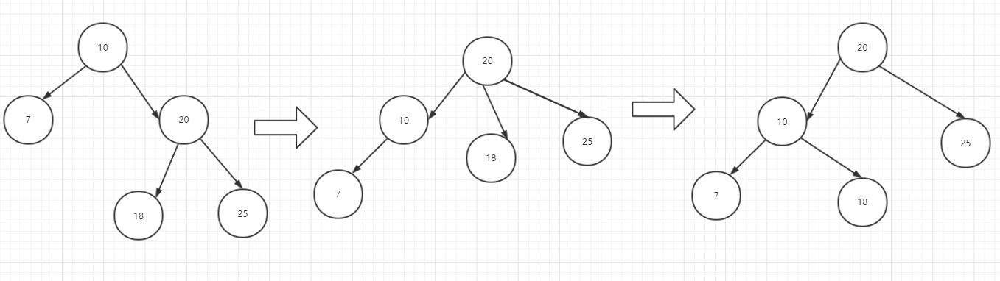
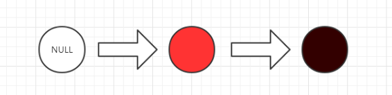

#### 红黑树

treap

由于二叉查找树在多次删除或者新增的操作后，可能导致树不够**平衡**，又或者可以称作**倾斜**，导致增删改插的时间复杂度增加，所以我们要保障每次进行新增或者删除的时候，不会让二叉树失去**平衡**

高度(完美)平衡的二叉树(AVL树)

* 可以允许空树
* 假如不是空树，任何一个节点的左子树与右子树都是平衡二叉树，并且高度之差的绝对值不超过1

首先需要声明的是，在jdk1.8之前，HashMap在插入元素时发生hash碰撞的时候，会采用链表的形式来存储元素，而在1.8之后，当超过链表超过8个这个阈值的时候，会转变为红黑树。

红黑树(平衡二叉查找树)其实并不是严格意义上的AVL树，原因是，如此**平衡**的树实现起来是很困难的，再者理解起来也很困难，所以红黑树是一个相对平衡的二叉查找树，可能左右的高度之差会是AVL树所定义的一倍，但是看起来还是**相对平衡的。**

红黑树的定义

* 根节点是黑色的
* 每个叶子节点都是黑的空节点(NIL)，也就是说，叶子节点不存储数据
* 任何相邻的节点都不能同时为红色，也就是说，红色节点是被黑色节点所隔开的
* 每个节点，从该节点到达其可达叶子节点的所有路径，都包含相同数目的黑色节点。

#### 左旋

例如这个时候，以10这个节点进行左旋，这个左旋转的操作可以看做是以10这个节点为原点，将右边的子树向上**提升**，**甩到上面**，这个时候10变成了20的子节点，但是由于二叉树特性，最多只能有两个节点，所以18作为20的左子树，将会被重新插入到10的右边，来保证二叉查找数的定义。

#### 右旋

沿用上面左旋的定义，20这个节点右旋的时候，可以看做是右边子树的**降级**，10将往上提升，然后18重新插入到他该在的位置。

插入的时候，节点必须是红色

插入的几种情况

> 第1种：刚好是个空树，红节点作为根节点插入后直接变黑

> 第2.1种：插入的节点的父节点和叔叔节点都是红色，这明显违背了红黑树的定义，所以要进行调整

 

假设一个红黑树，要插入一个节点，首先这个节点肯定是红的，在插入后，我们发现是不符合红黑树的定义的，因为我们发现父节点和叔叔节点都是红色的。对于如何让**不红黑树**的树变成符合红黑树其实有几个固定的公式，类似和**魔方**一样，每一面的转法和调整都是有固定公式，只要不断的重复，迭代最终会达到你要的效果

为止，这个和红黑树的调整方法是一致的。

我们首先，将这个插入的节点`x`的父节点和叔叔节点都变成**黑色**，然后再把祖父节点变成红色，如果这个祖父节点已经是**根节点**了，那么只需要把把祖父节点再次变成黑色即可。如果这个的祖父节点还存在父级节点，那么将祖父节点再次看做是x节点接着用上述方法进行迭代，直到找到根节点，完成红黑树的定义的调整。

> 第2.2种：插入的节点，只有父节点是红节点，叔叔节点是黑节点(左左，即插入是左子节点的左子节点)

首先，我们需要以插入元素的祖父点作为中心，对树进行**右旋**，接着将父节点和祖父节点颜色进行切换。

> 第2.3种，插入的节点，只有父节点是红节点，叔叔节点是黑节点(左右，即插入是左子节点的右子节点)

首先，插入的是节点的右子树的时候，对父节点进行**左旋**，这样x节点就被提升上来了，然后符合第三种左左的情况，对祖父节点进行**右旋**，再重新着色。

> 第2.3种，插入的节点，只有父节点是红节点，叔叔节点是黑节点(右右，即插入是右子节点的右子节点)

祖父节点左旋，然后变色。

> 第2.4种，插入的节点，只有父节点是红节点，叔叔节点是黑节点(右左，即插入是右子节点的左子节点)

首先对父节进行**右旋**，接着重新构建父子关系，然后就像是右右的关系一样，对祖父节点进行左旋，然后切换颜色。

> 作业：用10，70，32，34，13，56，21构建一个红黑树

我的作业

